# 데어 랑그릿사 FX 한국어 패치

**영문·숫자는 그대로, 나머지 게임 텍스트는 한글로.**

PC-FX 일본판 **Der Langrisser FX**의 한국어 패치입니다. 영문·숫자 표기를 제외한
게임 전반의 한글화를 위한 프로젝트로, **메인화면·대사·메뉴 용어를 한글로 옮기고
동영상에는 한국어 자막을 추가**했습니다.

[**v0.86 다운로드**](https://github.com/OldManCraveGuitars-bit/langrisser-fx-korean-patch/releases/tag/v0.86) ·
[설치 안내](patch/INSTALL.txt) ·
[수정 내역](CHANGELOG.md) ·
[**버그·번역 오류 제보**](https://github.com/OldManCraveGuitars-bit/langrisser-fx-korean-patch/issues)

**원본 일본판 Track 2 확인값**

```text
Size:     755,535,312 bytes
SHA-256:  1013D1AECCD42BB46DEA36CF3BD088CAE02FAC5D25BF4BC0187821ACAB9F8AD0
```

225섹터 프리갭을 포함한 원본 RAW MODE1/2352 Track 2 BIN 기준입니다.

**패치 적용 후 Track 2 확인값 — v0.86**

```text
Size:     762,048,000 bytes
SHA-256:  15741244E1291043884EA2E944EA2D1BE21521719DB42529CD0F984B7B906372
```

원본 게임이나 다운로드 ZIP이 아닌, 패치 적용 후 생성된 `Track-2.KR.bin`의 값입니다.

현재는 **사전 공개 버전**입니다. 번역 누락·오탈자·글자 깨짐·진행 오류 등
버그가 남아 있을 수 있습니다. 문제가 보이면 아래 안내에 따라 **GitHub Issues에
등록해 주세요.** 한글화 범위 소개가 모든 시나리오·분기의 무오류를 보장하지는 않습니다.

## 한글화 범위

- **메인화면 한글화** — 타이틀 로고, 시작하기·불러오기 등 시작 화면.
- **대사 한글화** — 인물 대사, 시나리오 제목과 나레이션.
- **메뉴 관련 용어 한글화** — 출격 준비, 저장·불러오기, 승리·패배 조건, 게임 설정 등 메뉴 전반.
- **동영상 한국어 자막 추가** — 원본 음성을 유지하고 영상에 한국어 자막 표시.

`LOAD`, `SCENARIO`, `TURN`과 능력치 약어 등 **영문·숫자 표기는 유지**합니다.
아래는 사용자가 제공한 실제 플레이 화면입니다. 특정 빌드의 전체 검증을 대신하는
자료는 아닙니다.

## 스크린샷

### 메인화면과 불러오기

| 한글 타이틀·시작 메뉴 | 타이틀 불러오기 |
| --- | --- |
| 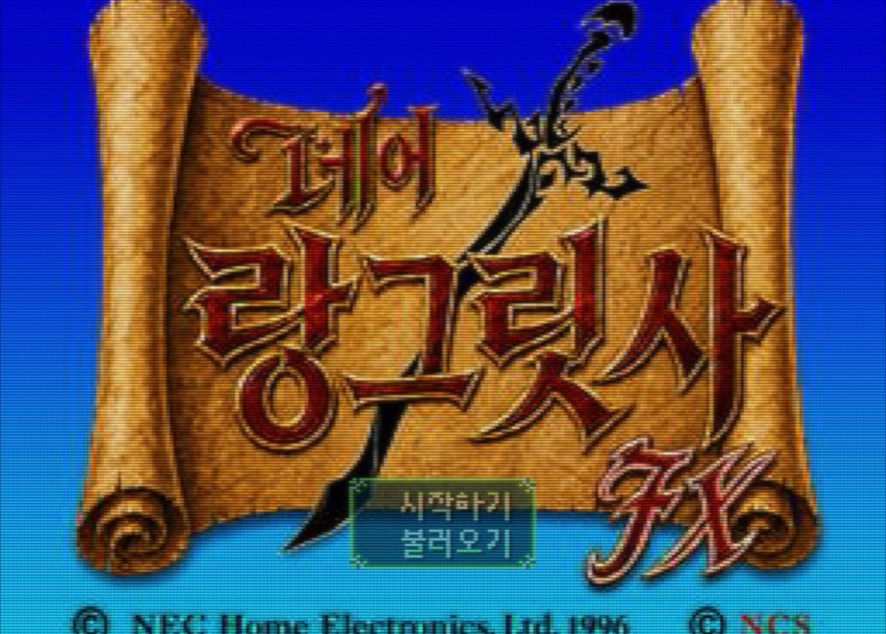 | 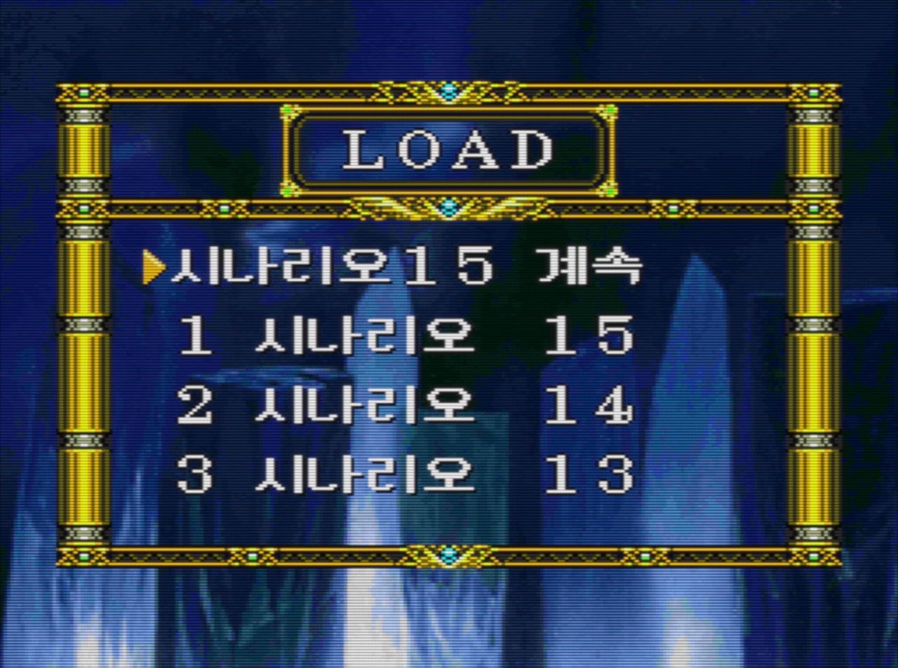 |

### 대사·시나리오 한글화

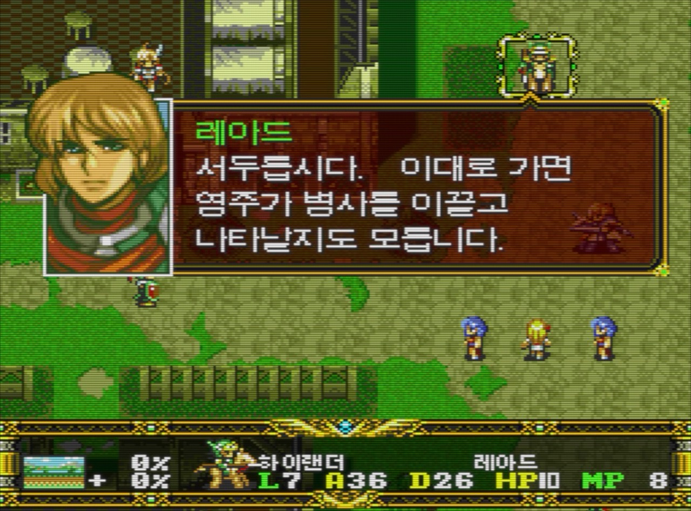

| 시나리오 제목 | 시나리오 나레이션 |
| --- | --- |
| 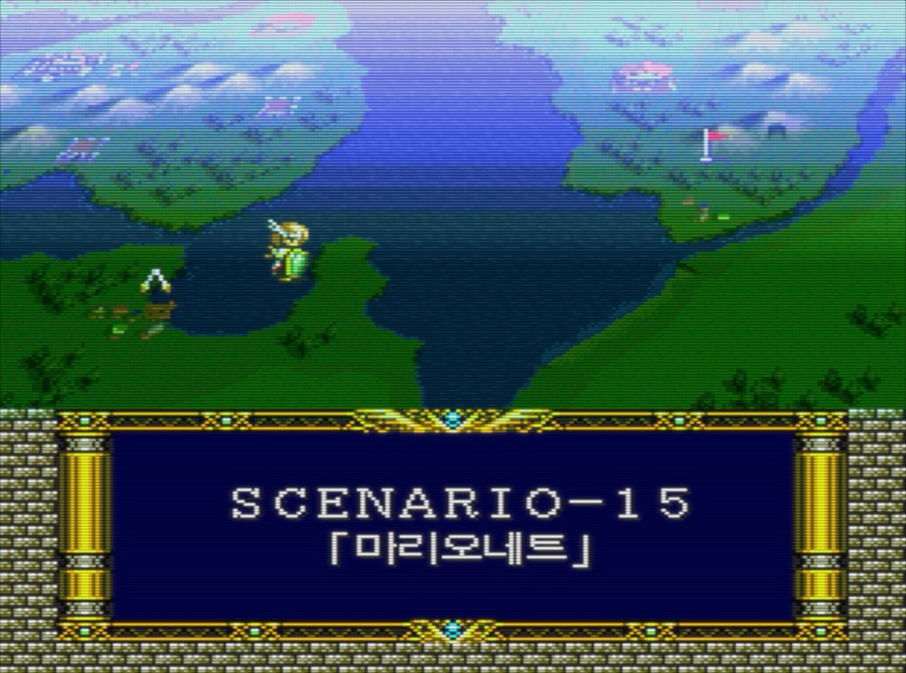 | 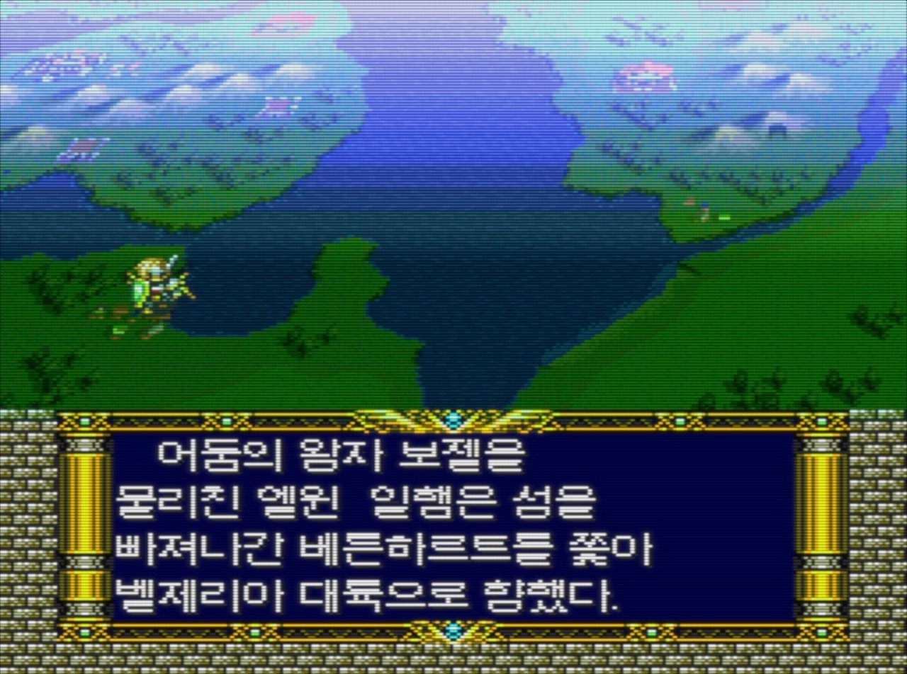 |

### 메뉴·설정 한글화

| 출격 준비 | 게임 중 시스템 메뉴 |
| --- | --- |
| 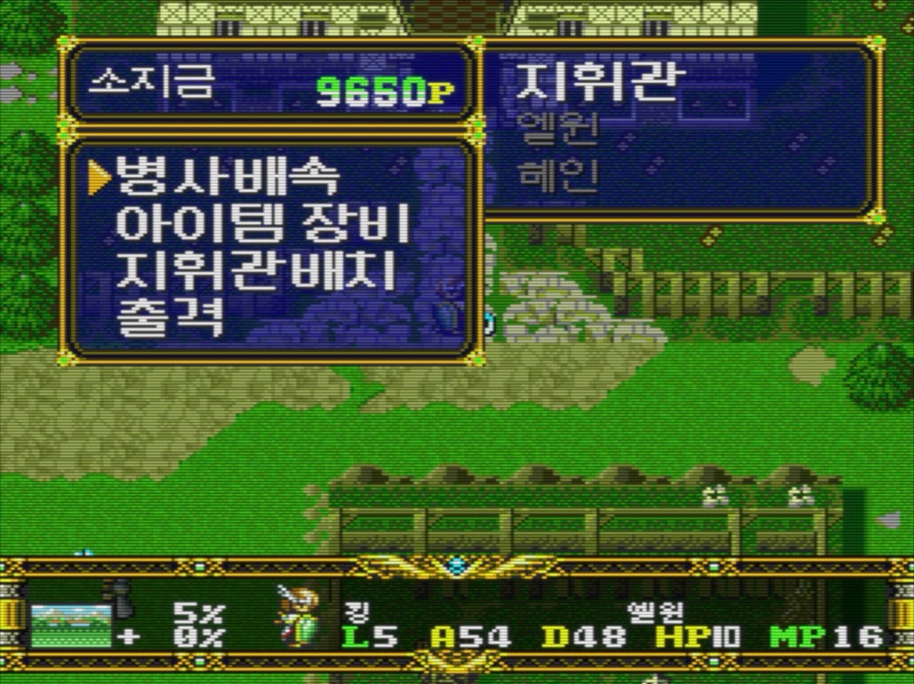 | 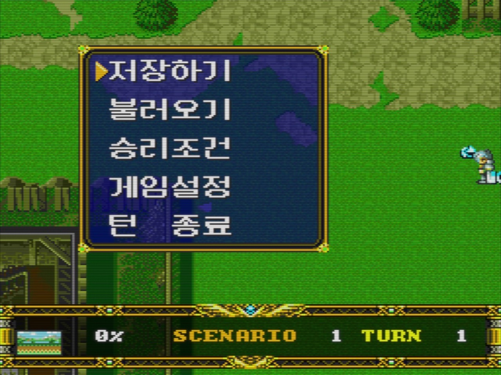 |

| 승리·패배 조건 | 게임 설정 |
| --- | --- |
| 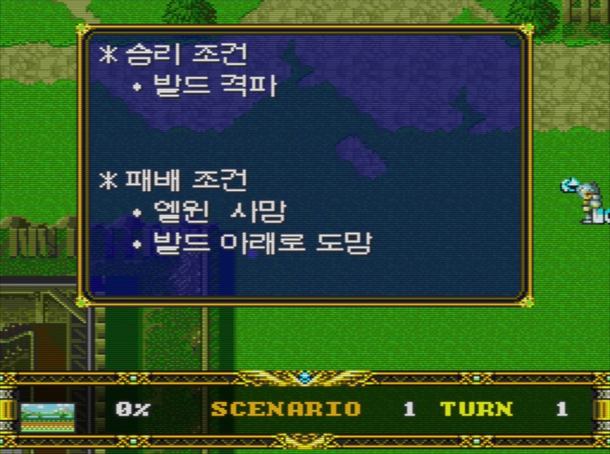 | 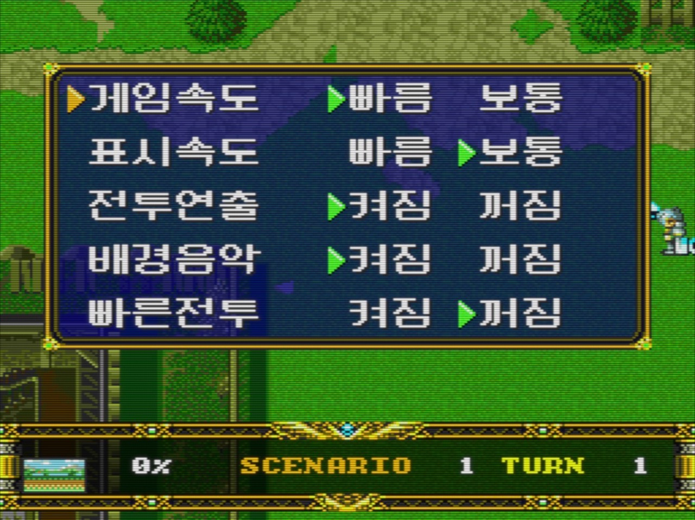 |

<details>
<summary>게임 중 불러오기 화면 보기</summary>

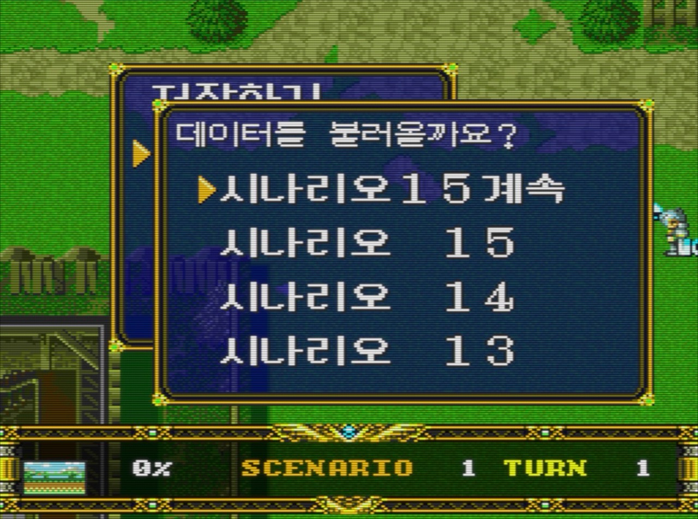

</details>

### 동영상 한국어 자막

| 자막 예시 1 | 자막 예시 2 |
| --- | --- |
| 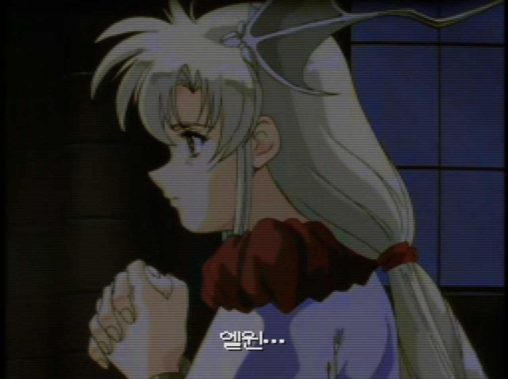 | 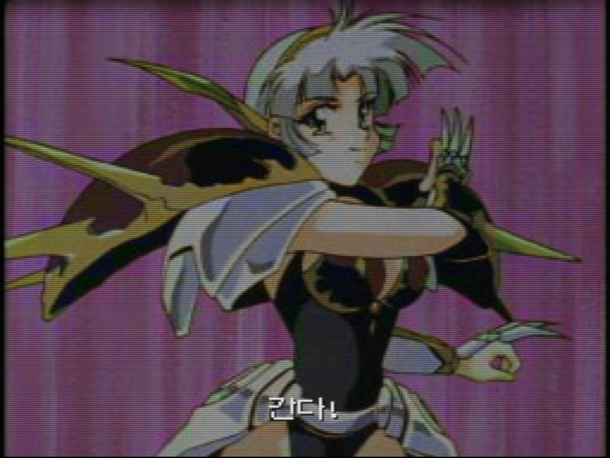 |

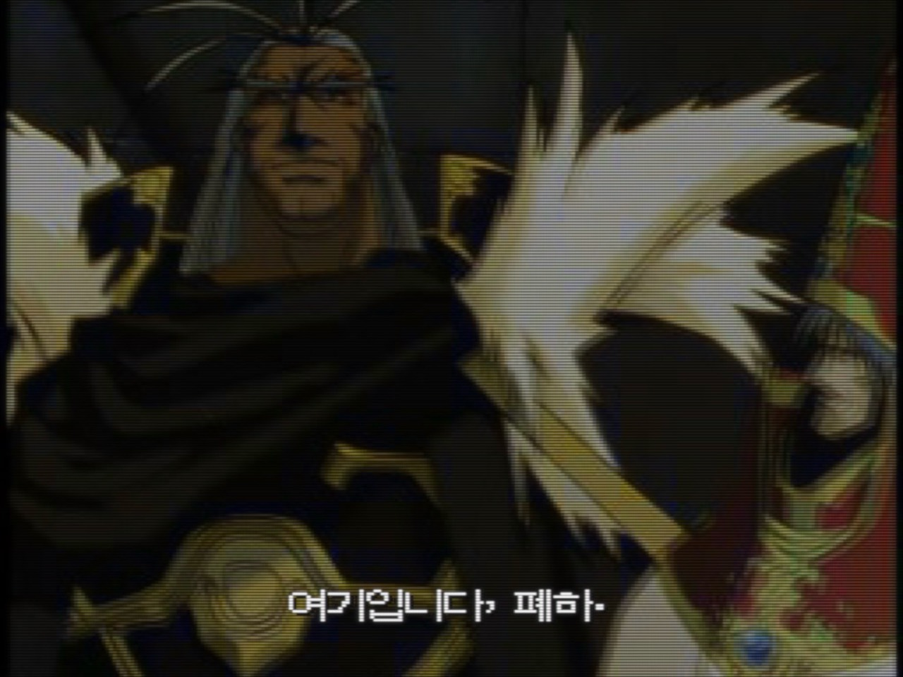

사진은 보정·재압축 없이 제공된 원본 그대로 사용했습니다.
[사진 출처와 이용 범위](screenshots/showcase/README.md)

## 패치 적용 방법

1. [v0.86 Release](https://github.com/OldManCraveGuitars-bit/langrisser-fx-korean-patch/releases/tag/v0.86)에서 **Langrisser_FX_Korean_Patch_v0.86.zip**을 내려받아 압축을 풉니다.
2. **Langrisser-FX-KR-Auto-Patcher-v0.86.exe**를 실행합니다.
3. 지원되는 **원본 일본판 CUE**와 새 출력 위치를 선택합니다. 원본 BIN 3개는 CUE와 함께 두세요.
4. 완성된 `Langrisser FX Korean Patch` 폴더의 `Langrisser-FX-KR.cue`를 실행합니다.

**이전 한글판 BIN에 덧씌우지 말고 원본 일본판에 새로 적용하세요.**
자동 패처는 원본과 기존 출력을 덮어쓰지 않습니다. 원본 게임·BIOS·세이브는
제공하지 않으며, 지원되는 원본 게임을 직접 준비해야 합니다.

SRAM은 백업하고 게임 내 저장을 불러오세요. 이전 빌드의 강제 상태 저장은
옛 코드까지 복원할 수 있으므로 사용하지 않는 것을 권장합니다.
원본 조건·체크섬과 Python 수동 적용 방법은 [설치 안내](patch/INSTALL.txt)에 있습니다.

## 버그·번역 오류 제보

**번역 누락, 어색한 대사, 글자 깨짐, 자막 누락, 멈춤 등의 문제가 있으면
[GitHub Issues에 등록해 주세요.](https://github.com/OldManCraveGuitars-bit/langrisser-fx-korean-patch/issues/new)**

가능하면 다음 정보를 함께 적어 주시면 확인에 도움이 됩니다.

- 사용한 패치 버전과 에뮬레이터·기기
- 시나리오 번호, 턴, 해당 인물이나 메뉴
- 문제가 발생하기까지의 조작 순서
- 기대한 내용과 실제로 나온 내용, 스크린샷
- 재현용 게임 내 세이브가 있다면 첨부 가능 여부

원본 게임 이미지·BIOS·개인정보는 이슈에 올리지 마세요.
이미 등록된 같은 문제가 있는지도 먼저 확인해 주세요.

## 현재 상태와 개발 자료

v0.86에는 **17화 대사 129개 검수·28곳 수정**, 로우가 처치 뒤의 **실제 수령자·
홀리 로드 장비 안내 수정**, 15화 추가 사용자 수정 2건이 포함됩니다.
일본판의 페이지·대기·이름 제어 순서를 유지했습니다. 앞선 하단 이름·전투 프리징
수정도 누적 포함합니다. [수정 전후 스크린샷과 보고서](docs/RELEASE_v0.86.md)를 확인해 주세요.

숨은 분기와 일부 조건 문구의 검수, 전 시나리오 플레이 확인은 아직 남아 있습니다.
기존 누적 도구 검사의 실패 8개·오류 1개를 해결했다는 뜻도 아닙니다.
정확한 적용·검증 범위와 남은 사항은 아래 문서를 확인해 주세요.

- [v0.86 수정 리포트](docs/RELEASE_v0.86.md)
- [v0.86 검증 범위와 알려진 한계](docs/VERIFICATION_v0.86.md)
- [기술 구조](docs/ARCHITECTURE.md) · [빌드·패치 생성 방법](docs/BUILDING.md)
- [폰트 등 제3자 자료](docs/THIRD_PARTY.md)

공개 저장소에는 직접 작성한 코드·문서·번역 자료의 선별본과 패치가 있습니다.
원본 추출 자료 등 일부 의존 파일이 제외되어 있어 전체 게임을 소스만으로
한 번에 빌드하는 환경은 아닙니다.

## 제작 및 권리 안내

**기타 깎는 노인 (GiKakNo)**와 기여자들이 번역·개발·검증을 진행합니다.
프로젝트가 권리를 보유한 코드·문서·번역 기여분에는 [MIT 라이선스](LICENSE)를 적용합니다.
원작 게임·캐릭터·그래픽·영상·상표 및 스크린샷 속 원작 자료에는 적용되지 않습니다.
[라이선스 적용 범위](LICENSE_SCOPE.md)를 확인해 주세요.

비공식 팬 번역 프로젝트입니다. 원본 게임이나 패치 적용이 끝난 게임 이미지를
재배포하지 마세요.

---

## English

This project translates the game's Japanese text into Korean while retaining
English labels and numbers. It covers the title screen, dialogue, narration and
menus, and adds Korean movie subtitles while retaining the original audio.
The screenshots above were supplied by the maintainer.

**Bugs, untranslated text, wording issues or missing subtitles may remain.**
Please report them through [GitHub Issues](https://github.com/OldManCraveGuitars-bit/langrisser-fx-korean-patch/issues),
including the patch version, emulator/device, scenario, reproduction steps and
screenshots. Do not upload original game images, BIOS files or personal data.

<details>
<summary>English project status, installation, technical details and credits</summary>

This repository candidate documents and distributes a Korean translation patch for the Japanese PC-FX release of **Der Langrisser FX**. It contains a source-verified delta patch, a dependency-free patch applier, selected project-authored source code, and technical documentation. It does **not** contain the original game, a fully patched disc image, PC-FX BIOS files, emulator binaries, or extracted game media.

## Project status

The current public version is **v0.86** (internal successor296). This remains
a development/prerelease, not a final-completion claim. It reviews all 129
Scenario 17 dialogue records and adopts 28 wording/layout corrections, including
Rouga's erroneous self-name. Japanese page/wait/name controls are preserved.
The Holy Rod transfer message now shows its actual recipient, subject particle
and equipment, trimming only transient trailing name/item padding.
Two additional maintainer-authored Scenario 15 edits are also included.
Shared fonts/dictionaries, menus, battle data, conditions and subtitles are unchanged.
Earlier fixes, including the Angel-versus-Phoenix freeze and HUD name-prefix
repairs, remain included. See the [change report](docs/RELEASE_v0.86.md)
and [verification scope](docs/VERIFICATION_v0.86.md).
Full hidden-dialogue wording review and all-scenario playthroughs remain incomplete.
The earlier cumulative tool baseline recorded 8 failures and 1 error; their
resolution is not claimed here.

Download the automatic patcher from [GitHub Releases](https://github.com/OldManCraveGuitars-bit/langrisser-fx-korean-patch/releases/tag/v0.86).

The translation editor's current catalogs enumerate these working domains:

- 9,508 dialogue records across Scenarios 1–70.
- 150 subtitle cues for 23 voiced movies; all 30 movie IDs are selectable for review.
- 462 narration records across 98 identified presentations.
- 336 victory/defeat-condition records, including presentation and system-menu forms.
- 134 ending character-epilogue records.

Outside that historical Scenarios 1–70 editor catalog, Muscle Temple has 86
nonempty dialogue records and one empty slot. X2 adds 97 nonempty records; X3
adds 146 nonempty records and retains two empty slots. These counts describe
implemented populations, not percentages or complete human/hardware QA.

## Implemented technical work

The selected source and current project records show implementations for:

- Korean glyph generation and multiple consumer-specific font contexts, including a resident 12×12 Hangul set and a separate movie-subtitle glyph set.
- A private two-byte text encoding, dictionary-backed strings, token preservation, and width/page validation.
- Dialogue, narration, system-message, menu, shop, item-name, and item-tooltip changes.
- Victory/defeat-condition layout, dynamic character names, half-width indentation, and scenario-number/title centering.
- 8×8 bottom-HUD name/class rendering and class/category label repairs.
- Movie subtitles used by both OMAKE movie IDs and their natural-play aliases.
- PC-FX RAINBOW title-image replacement and title-menu resource work.
- Raw MODE1/2352 Track 2 regeneration with changed-sector EDC/ECC repair.
- Source/result hash checks and exact-diff verification for the newest final-stage builders.

See [Technical architecture](docs/ARCHITECTURE.md) for the boundaries and evidence behind these statements.

## Apply the patch

You must supply your own legally obtained Japanese game dump. The patch accepts only this exact raw Track 2 representation:

| Input | Size | SHA-256 |
| --- | ---: | --- |
| Original Japanese raw MODE1/2352 Track 2, including the 225-sector pregap | 755,535,312 bytes | `1013D1AECCD42BB46DEA36CF3BD088CAE02FAC5D25BF4BC0187821ACAB9F8AD0` |

### Windows automatic patcher

Run `Langrisser-FX-KR-Auto-Patcher-v0.86.exe`, select the original Japanese CUE, and
choose an output location. The program verifies all three original track files
and creates a complete `Langrisser FX Korean Patch` folder containing the new
Track 2, unchanged copies of Tracks 1 and 3, a ready-to-use CUE, and checksums.
It never overwrites the original disc files or an existing output folder.

The Python source is `patch/langrisser_fx_auto_patcher.py`; maintainers can
rebuild the Windows executable with `tools/build_windows_patcher.ps1`.

### Command-line fallback

Python 3 is required. The applier uses only the Python standard library.

```powershell
python patch/apply_patch.py "path/to/original Track 2.bin" "Track-2.KR.bin" --patch patch/Langrisser-FX-KR-v0.86.lfxpatch
```

Successful application produces:

- size: 762,048,000 bytes
- SHA-256: `15741244E1291043884EA2E944EA2D1BE21521719DB42529CD0F984B7B906372`

Copy your unchanged original Track 1 and Track 3 into the same directory as `Track-1.bin` and `Track-3.bin`, then use the supplied [CUE sheet](patch/Langrisser-FX-KR.cue). Do not overwrite your original tracks. Full bilingual instructions are in [INSTALL.txt](patch/INSTALL.txt).

Apply this cumulative patch to the **original Japanese dump**, not to an older
patched image. Back up SRAM saves and load an in-game save after changing builds;
old emulator save states can restore old patched code.

## Build and patch generation

The public source is a curated implementation snapshot, now including the
Scenario 17 review and recipient-aware equipment formatter, the Scenario 13/14
reviews, and the selected Scenario 15 writers,
alongside the v0.851 context-aware HUD prefix helper, v0.85 native
archive-boundary/HUD font modules and earlier selected dialogue, complete
menu/unit-cache separation, hidden-dialogue and subtitle work.
Its private primary build starts with the immutable Japanese Track 2 and the
hash-pinned v0.81 cumulative delta specification, reconstructs that baseline
within the build, then applies a conflict-checked composed write plan. Existing
patched game outputs are comparison evidence, not its input. Some source-derived
catalogs and historical authoring dependencies remain private, so these source
snapshots are for inspection, not a complete standalone source build.

For that reason, this candidate does **not** claim a complete clean-room, one-command product build from the original disc. Source-derived catalogs and private intermediates are deliberately excluded. Maintainers who already possess the exact original and exact verified target can regenerate the distributable delta with:

```powershell
python tools/create_lfx_patch.py ORIGINAL_TRACK_2.bin VERIFIED_TARGET_TRACK_2.bin patch/Langrisser-FX-KR-v0.86.lfxpatch
```

The generator requires NumPy. See [Building and verification](docs/BUILDING.md) for current limitations and consolidation work still needed.

## Fonts and text output

Project records identify GNU Unifont 17.0.05 as the byte-pinned source for the current resident 12×12 Hangul raster. The movie subtitle path uses a separate 12×12 glyph set. Several UI consumers use different physical font resources and mappings, so their code spaces must not be merged. The 8×8 bottom-HUD work references Galmuri7. Font source files are not bundled; the applicable GNU Unifont and Galmuri license notices are retained. See [Third-party material](docs/THIRD_PARTY.md).

## Known issues and limits

- The earlier cumulative tool baseline was not fully green: 8 known failures and 1 known error were recorded. Their resolution is not claimed by v0.86.
- The new Muscle Temple and X2/X3 dialogue passes the recorded technical checks, but full human wording review and all hidden branches remain unfinished.
- An all-scenario playthrough and physical-console/iPhone verification are not recorded for the complete v0.86 scope.
- Scenario 17 was reviewed across all 129 records; 28 changes were adopted. Four ambiguous/empty-source records remain unchanged pending further context. Arbitrary player-renamed names and all story branches are not runtime-certified. See [current verification](docs/VERIFICATION_v0.86.md).
- The earlier Scenario 13/14 review covers 174/104 records and preserves their 243/125 native pages. Its introductory checks remain historical evidence, not new all-branch playthroughs.
- v0.851 was cold-tested on Scenario 12 name/menu/empty-ground transitions and Scenario 10 name/SCENARIO transitions. All 167 name IDs, 333 native/alias execution cases and 201 glyphs per bank were checked separately. See [historical verification](docs/VERIFICATION_v0.851.md).
- The earlier v0.85 target was checked through cold SRAM loads for Scenario 12 Angel-versus-Phoenix combat, the Royal Lancer HUD and Scenario 10 combat/results, plus automatic Opening 2 and OMAKE playback. All 629 intervals in the two repaired directories were checked. This is targeted runtime verification and shared-data coverage, not every battle or stage. See [verification](docs/VERIFICATION_v0.85.md).
- Earlier X2/X3 and menu/shop/load runtime evidence remains attributed to its original version. Every natural movie trigger was not replayed for v0.85; current movie/subtitle bytes are unchanged.
- Previously recorded condition-text issues in other internal fields 74–98 were not repaired by this update. Internal field/container counts are not counts of additional playable scenarios.
- Some editor/build data catalogs contain substantial extracted Japanese text and are withheld pending a rights decision.
- The public source snapshot cannot reproduce the full patched disc without private/source-derived intermediate data.
- Emulator compatibility outside the recorded Mednafen/Beetle PC-FX routes is not guaranteed.

## Development and test environment

- Windows development host.
- Python 3.13 for the current packaging/audit pass.
- Mednafen 1.32.1 and Beetle PC-FX/libretro were used in recorded emulator QA paths.
- Pillow and NumPy are used by parts of the development and verification tooling.
- A user-supplied PC-FX BIOS is required for emulation and is never included here.

## Repository layout

```text
data/translations/   Korean-only editor delta selected for publication
docs/                architecture, build, audit, and licensing notes
patch/               delta patch, applier, CUE, and installation guide
src/dialogue_editor/ translation editor source snapshot
src/patch_pipeline/  current final-stage build/source snapshot
tests/               patch-container regression tests
screenshots/showcase/ maintainer-provided gameplay introduction photos
screenshots/v0.851/   historical before/after defect evidence (not MIT game art)
screenshots/v0.86/    Rouga and equipment-message before/after evidence
third_party/         retained third-party license notices
tools/               maintainer-only delta generator
release/             local GitHub Release upload candidate (ignored by Git)
```

## Credits

- Project copyright-holder display: **기타 깎는 노인 (GiKakNo)**.
- Korean translation, reverse engineering, patch development, testing, and documentation: the project maintainer and contributors.
- GNU Unifont and Galmuri authors: see [third-party notices](docs/THIRD_PARTY.md).
- Mednafen and Beetle PC-FX/libretro were used as development and verification tools; they are not bundled.
- **Der Langrisser FX**, PC-FX, and all original game code, graphics, audio, video, names, and trademarks belong to their respective rights holders.

## License and disclaimer

Project-authored code, scripts, documentation, and Korean translation
contributions are available under the [MIT License](LICENSE), to the extent the
project contributors own those rights. The copyright-holder line is
`Copyright (c) 2026 기타 깎는 노인 (GiKakNo)`. The license does not apply to
the original game or grant rights to copyrighted game data, trademarks, or
third-party material. See [license scope](LICENSE_SCOPE.md) for the exact
boundary.

This is an unofficial, non-commercial fan translation. You must own and supply the supported original game dump. No warranty is provided. Do not distribute original or fully patched disc images.

[Earlier project cover image](https://github.com/user-attachments/assets/f134092a-949d-47f3-b475-7084703d791f)

</details>
