# V0.96 — 초 랑그·후반 대사·엔딩 누적 업데이트

검증한 **successor302-review5**를 V0.96으로 공개합니다. v0.865 이후 로컬에서
작업한 내용을 누적한 **사전 공개 버전**입니다. 원본 일본판에 새로 적용해야 하며,
기존 한글판에 덧씌우는 증분 패치가 아닙니다.

## 주요 수정

- **초 랑그 메뉴를 일반 모드와 통일**: 저장·불러오기·승리조건·게임설정·턴 종료,
  설정 항목을 같은 한국어로 표시합니다. 타이틀에서 초 랑그 저장을 불러올 때
  한글 메뉴 작업 자원이 준비되지 않아 일본어가 섞이던 경로를 수정했습니다.
- **초 랑그 대사·제목 검수**: 977개 대사와 95개 나레이션·조건 화면을 원문과 대조하고,
  발드의 한자처럼 깨진 구두점, 루시리스 인사말의 큰 빈칸, 어색한 문맥과 호칭을
  고쳤습니다. 7개 장 제목을 중앙 정렬했습니다. 일본판 페이지 넘김·대기를 유지합니다.
- **실제 전투 중 승패 조건**: 나레이션과 별도였던 7장 메뉴 본문 22개를 수정했습니다.
  일본어·잘못 연결된 문구를 없애고 실제 승패 판정과 이름 변수는 보존했습니다.
- **공용 문구 105개 사본 정리**: `저장할까요?`, `그래도 살까요?` 등 정상 문구를
  유지하고, 소지 한도를 잘못 안내하던 `ITEM 없음`을 `더 들 수 없습니다`로 수정했습니다.
  아이템이 가득 찼을 때 버리기 안내의 일본어 혼용과 누락 사본도 복구했습니다.
- **20화 이후 대사 누락**: 54개 대사 풀 6,939항목을 원문과 대조하고 빈 본문
  148개 및 문맥·오타·페이지별 의미를 수정했습니다. 원래 영문 비명과 빈 항목은 보존합니다.
- **전투 이름 좌우 표시**: 그레이트 드래곤 같은 긴 오른쪽 병종명이 엘윈 쪽에
  표시되고 오른쪽이 비던 문제를 수정했습니다.
- **후일담·엔딩**: 후일담 134개/229페이지를 검수하고 스코트의 숫자 뒤 글자 깨짐과
  급한 페이지 전환을 수정했습니다. 엔딩 크레딧을 한글화하고 성우 이름 9개 항목의
  줄 넘침을 바로잡았습니다. 마지막 화면에 `데어 랑그릿사 FX` → `한글화 기타 깎는 노인`
  → `총 턴수`를 표시합니다. 턴수는 고정 숫자가 아닌 실제 플레이 값입니다.
- 앞선 시나리오 13·14·17·18, 장비 안내, 영상 자막, HUD 및 프리징 수정도 누적 포함합니다.

## 수정 전후 스크린샷

아래는 보정하지 않은 실제 실행 캡처입니다. 비교용 이전 빌드와 최종 빌드는
[출처 기록](../screenshots/V0.96/README.md)에 구분했습니다.

### 초 랑그 메뉴·조건·상점

| 수정 전 | V0.96과 같은 최종 302-review5 |
| --- | --- |
| 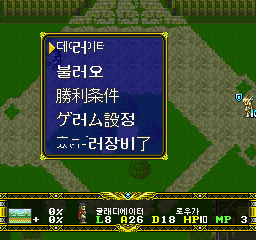 | 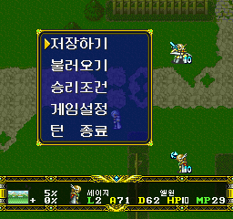 |
| 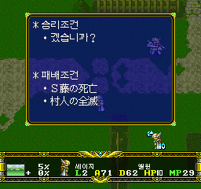 | 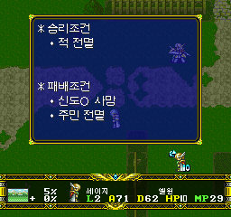 |
| 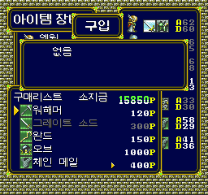 | 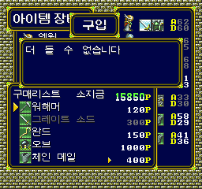 |
|  | 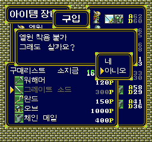 |

| 대사 글자 깨짐 수정 (301) | 제목 중앙 정렬 (최종 302) |
| --- | --- |
| 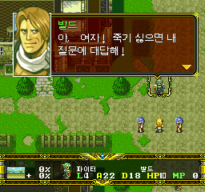 | 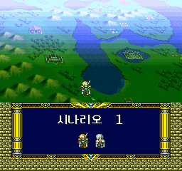 |

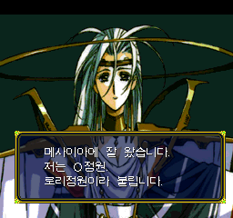

### 로우가·소니아 실제 교전 확인

최종 302-review5에서 정상 저장을 불러와 컨트롤러로만 교전했습니다. 188번은
로우가 역할 **T무라가 소니아 역할 F자와에게 말하는 장면**이므로 호칭을 `F자와씨`로
수정한 것이 맞습니다. 2페이지와 소니아의 답변, 사망 대사, 다음 8턴까지 확인했습니다.

| 188번 첫 페이지 | 소니아의 답변 |
| --- | --- |
| 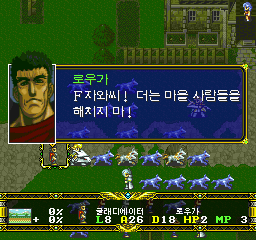 | 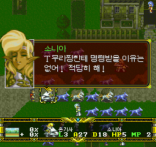 |

다음 페이지·사망·8턴 확인

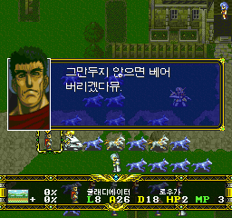
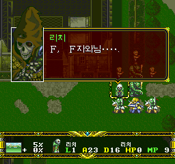
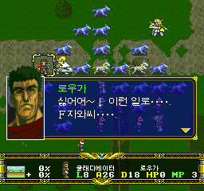
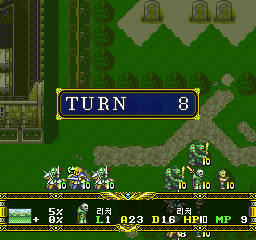

### 후반 대사와 전투 좌우 표기 (297 → 298)

| 수정 전 | 누적 수정 후 |
| --- | --- |
| 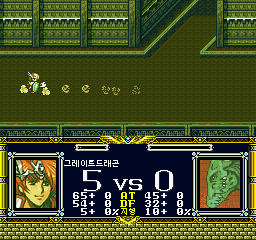 | 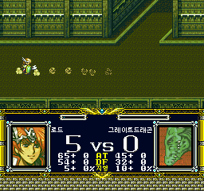 |
| 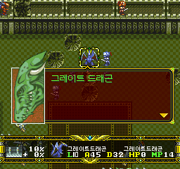 | 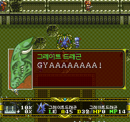 |

### 후일담·크레딧·아이템 안내 (298/299 → 300)

| 수정 전 | 누적 수정 후 |
| --- | --- |
| 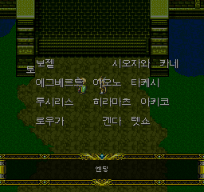 | 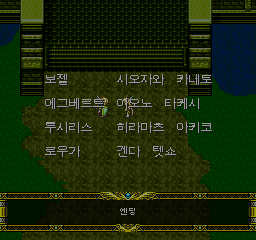 |
| 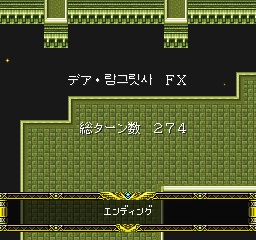 | 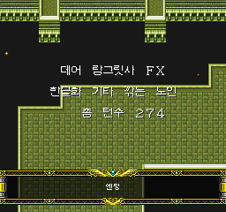 |
| 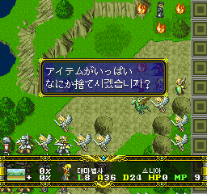 | 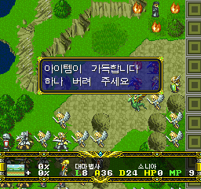 |

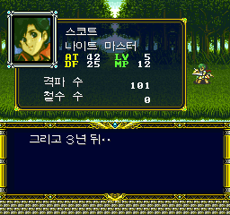

## 설치·세이브

[설치 안내](../patch/INSTALL.txt)에 따라 원본 일본판 CUE에 새로 적용하세요.
원본 게임·BIOS·세이브·완성된 게임 이미지는 포함하지 않습니다.
SRAM은 백업한 뒤 새 빌드에서 **게임 내 저장**을 불러오세요. 이전 버전의 강제
세이브스테이트는 옛 코드까지 복원할 수 있으므로 빌드 사이에 이어 쓰지 마세요.

## 알려진 한계·제보

- **간헐적인 엔딩 검은 화면은 미해결입니다.** 음악은 나오는데 크레딧이 보이지 않는
  사용자 보고가 있었으며 재시작 후 정상화 관찰만 있습니다. 원인이나 해결을 단정하지 않습니다.
- 전체 캠페인·모든 전투/사망/후일담 분기의 실플레이, 실기 및 iOS 검증은 완료되지 않았습니다.
- 검증한 초 랑그 7장 밖의 경로 미검증 조건 표에는 원문 잔존이 있습니다.
  모든 문자열이 완벽하게 한글화됐다는 보장은 아닙니다.
- 일부 숨김 던전 문안의 사람 검수와 기존 누적 도구 검사 실패 8개·오류 1개의 정리는
  별도 과제입니다. 이번 통과 검사로 그 문제가 모두 해결됐다고 주장하지 않습니다.

오류·누락·어색한 번역은 [GitHub Issues](https://github.com/OldManCraveGuitars-bit/langrisser-fx-korean-patch/issues)에
버전, 기기/에뮬레이터, 시나리오·턴, 재현 순서와 스크린샷을 함께 남겨 주세요.
자세한 범위는 [검증 보고서](VERIFICATION_V0.96.md)를 참조하세요.

## English summary

V0.96 is the cumulative development prerelease of successor302-review5. It includes
late-scenario omission and battle-label repairs, epilogue/credits localization,
inventory-full prompts, Super Langrisser dialogue/title review, normal-mode-equivalent
menus, seven actual condition tables and shared shop/save messages. Native page/wait
structure and game logic are preserved within the documented exceptions.
Actual final-build checks cover menus/shops, a normal Scenario 20 regression and
Rohga/Sonia combat, death dialogue and return to Turn 8. Earlier screenshots are labeled;
they are not a claim that every route was replayed on V0.96. The intermittent ending
black screen is unresolved. Use the original Japanese disc, back up SRAM, and report issues.
