# V0.97 — 대사·아이템 폐기·마법명·제국 엔딩 누적 수정

2026-09-19 · 내부 검증 빌드 **successor309** · 사전 공개 버전

[다운로드](https://github.com/OldManCraveGuitars-bit/langrisser-fx-korean-patch/releases/tag/V0.97) ·
[설치 안내](../patch/INSTALL.txt) · [검증 범위](VERIFICATION_V0.97.md)

## 디스크 확인값

**패치 적용 후 Track 2** — 다운로드 ZIP의 해시가 아닙니다.

```text
Size:     762,048,000 bytes
SHA-256:  6616EE3B5D544E9183A5A6E44BFF1BB8FC77F75D95696EEAE6DB157CD55390A8
```

**원본 일본판 Track 2** — 225섹터 프리갭을 포함한 RAW MODE1/2352 BIN입니다.

```text
Size:     755,535,312 bytes
SHA-256:  1013D1AECCD42BB46DEA36CF3BD088CAE02FAC5D25BF4BC0187821ACAB9F8AD0
```

V0.96 공개 이후 successor303~309의 수정을 모두 포함한 누적 패치입니다.
**기존 한글판에 덧씌우지 말고 원본 일본판에 새로 적용하세요.** SRAM을 백업하고
게임 내 저장을 불러오세요. 이전 빌드의 강제 상태 저장은 옛 코드까지 복원할 수 있습니다.
원본 게임·완성된 게임 이미지·BIOS·세이브는 포함하지 않습니다.

## 1. 시나리오 5의 제시카 대사 누락

`여러분께` 이후 비어 보이던 문장에서 빠진 의미를 복원하고 일본판과 같은
3페이지로 정리했습니다. 에그베르트보다 먼저 다크 로드를 얻어야 한다는
중간 문장을 복원했고, 마지막은 `저도 여러분께 / 힘을 보태겠습니다.`로 연결했습니다.
티아라·광휘의 후예 설명도 같은 페이지 안에서 자연스럽게 이어지도록 수정했습니다.

아래는 **수정 전 제보 사진**입니다. 수정 후 동일 장면 사진은 확보하지 못했습니다.
개발 검증은 최종 대사 데이터와 실제 로드를 확인했으며, 이후 사용자가 정상이라고 확인했습니다.

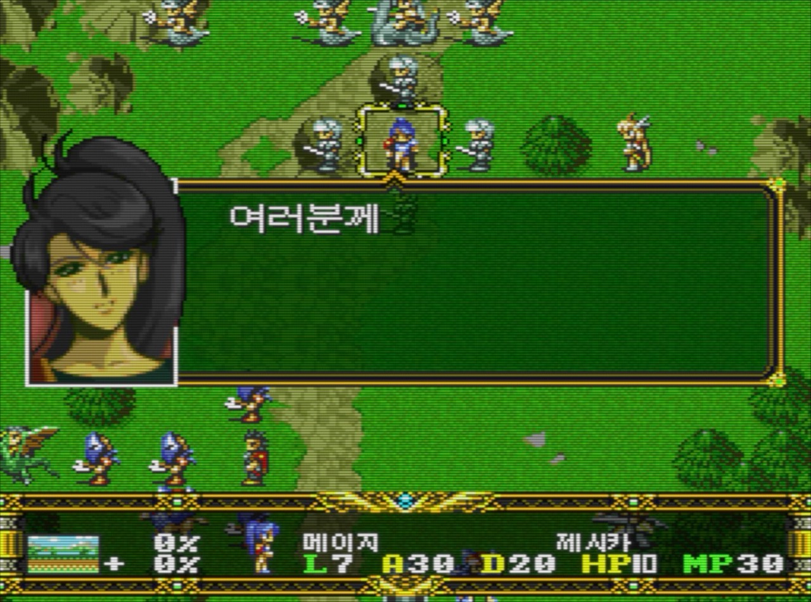

## 2. 시나리오 6 전체 대사 검수

125개 항목을 일본어 원문과 대조하고, 승인된 교정 22개와 표기 정리를 합쳐
54개 항목을 수정했습니다. 인물을 잘못 부른 `보젤!`은 `에그베르트!`로,
알하자드의 힘을 얻는 주체는 `우리는`에서 `폐하는`으로 고쳤습니다.
제시카를 보호하는 대사, 티아라 문맥, `홍`으로 적힌 감탄사 4곳, 효과음,
촉매 설명과 질문, `다크 로드` 표기 및 띄어쓰기를 정리했습니다.

| 수정 전 303 | 수정 후 304 |
| --- | --- |
| 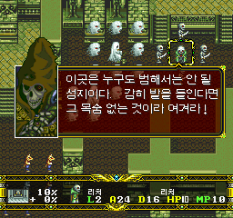 | 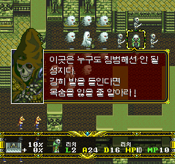 |
| 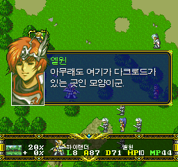 | 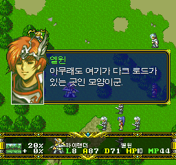 |

실행 확인은 시작 대사 000~007번입니다. 이후 분기는 원문·제어·표시 폭·최종 데이터 검사 범위입니다.

## 3. 시나리오 셀렉트 38·39 검수

- **38번:** 120항목 검수, 30항목 교정. `엘윈 라면` → `엘윈 이라면`.
  주민 대피, 전투 지시, 감사·부탁의 어투와 직역투를 다듬었습니다.
- **39번:** 110항목 검수, 32항목 교정. `나는 엘윈 다.` → `나는 엘윈 이다.`.
  적을 물속에 숨겨 두었다는 의미, 아론의 말투, 수식·인용·지시 표현을 정리했습니다.

이름 변수를 하드코딩하지 않았습니다. 기본 이름 엘윈에 맞춘 조사 수정이며,
사용자가 입력하는 모든 이름의 받침을 자동 판별하는 새 기능은 아닙니다.

| 수정 전 제보 | 수정 빌드 진입 확인 — 해당 대사 장면은 아님 |
| --- | --- |
| 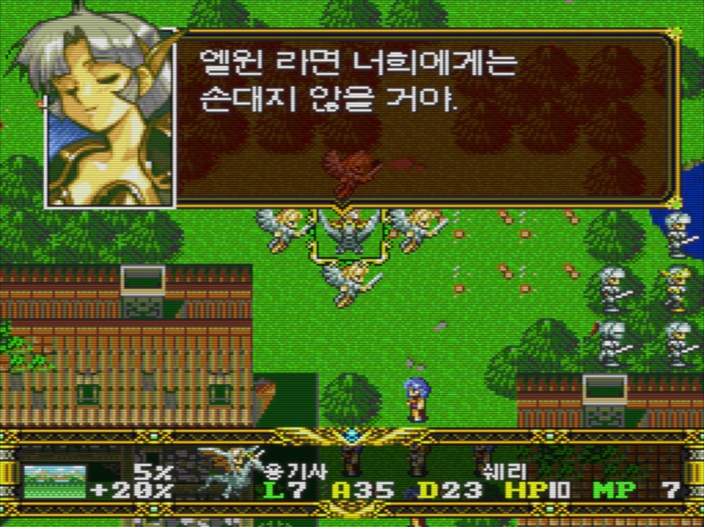 | 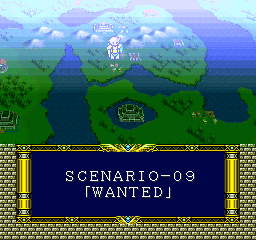 |
| 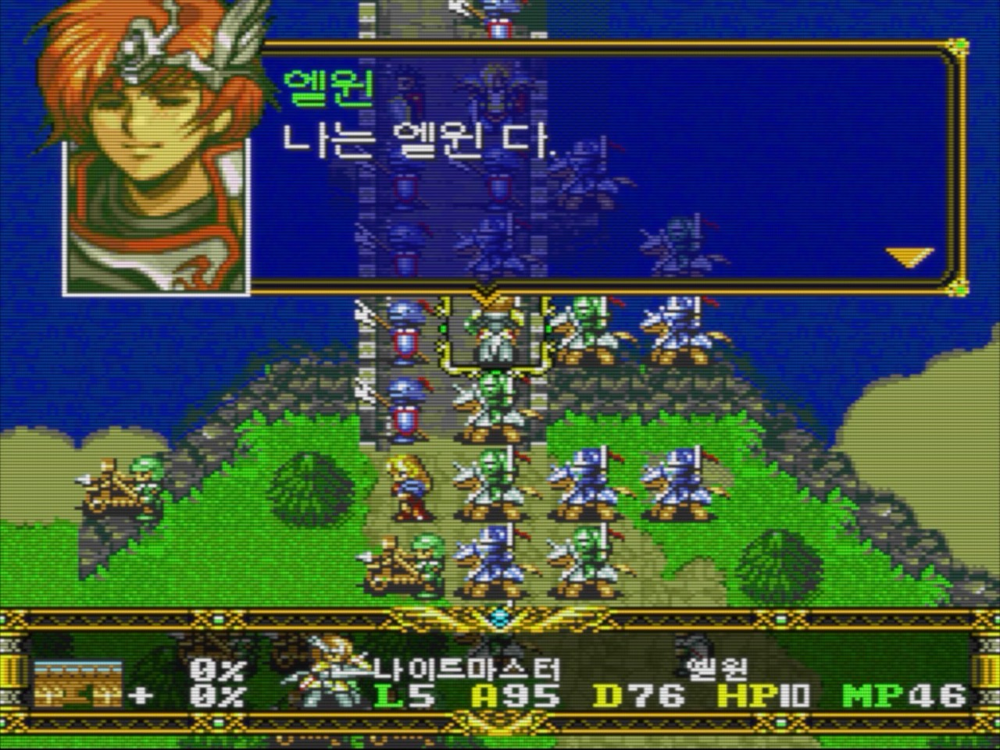 | 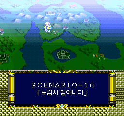 |

## 4. 아이템 폐기 글자·테두리 깨짐

아이템이 가득 찼을 때 워해머를 버리면 뒤에 잔여 글자가 남고,
그레이트 소드를 버리면 오른쪽 테두리가 깨지던 공용 안내를 수정했습니다.
5개 문구 × 105복제본의 공백·문자열 끝 처리를 고쳤으며 아이템 ID와 보상 규칙은 그대로입니다.

| 수정 전 제보 | 수정 후 실제 UI |
| --- | --- |
| 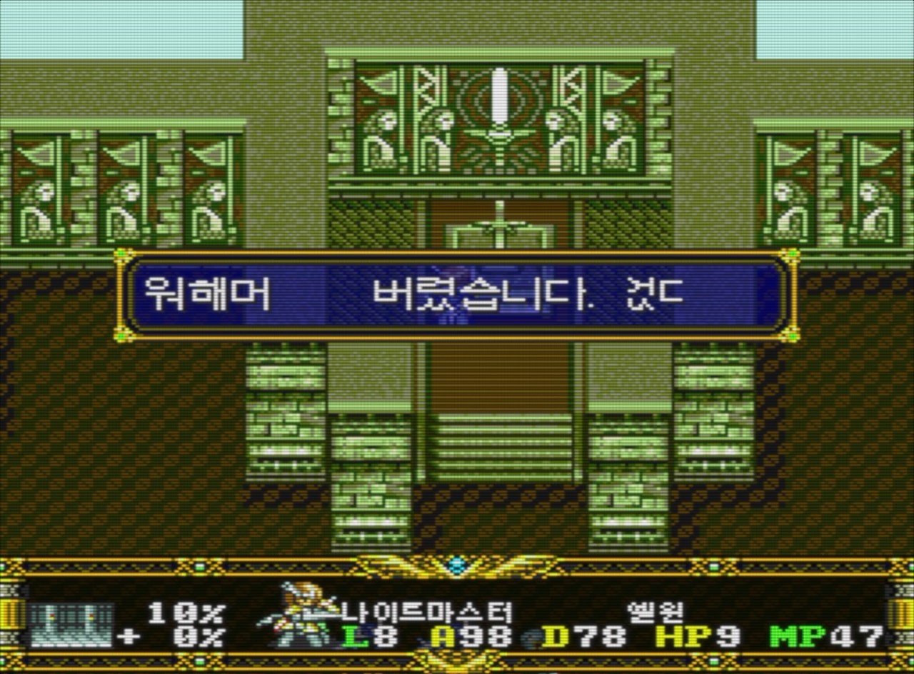 | 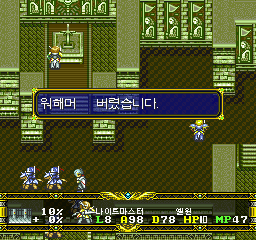 |
| 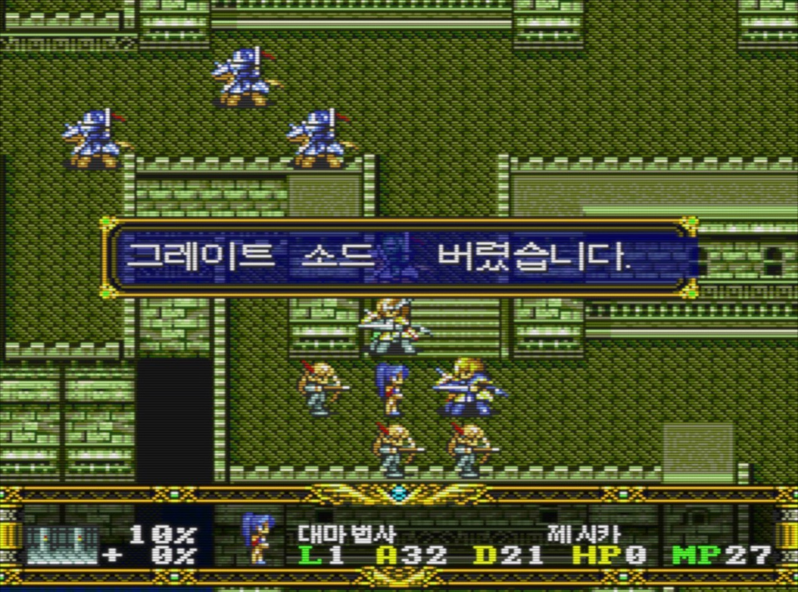 | 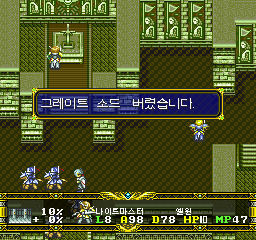 |

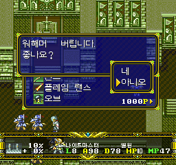

워해머는 첨부 SRAM을 그대로 불러와 셰리 격파 → 폐기 → 보상 처리까지 확인했습니다.
그레이트 소드는 저장에서 장비 중이어서, **별도 테스트 상태의 장비 소유 정보 2바이트를
해제한 뒤** 실제 메뉴로 확인했습니다. 원본 SRAM 그대로의 재현과 구분합니다.

## 5. 엘윈 조사와 나머지 대사 검수

이름 문맥 527행을 조사해 `엘윈 는/가/를/와/라면/다` 등의 조사를 문맥에 맞게
다듬었습니다. 최근 검수 밖의 15개 챕터 2,322행도 직접 일본판과 대조했습니다.
누락 문장, 반대 뜻의 명령, 잘못된 인명·지명과 어색한 문장을 고쳤습니다.
일본어가 남아 있던 내부 분기 복제 74~78에는 원문이 동일한 검수 번역을 연결했습니다.
이 단계의 의미 변경은 1,128행이며, 그중 689행은 분기 복제 번역 복구입니다.
이 수치는 이후 50번 재교정 수치와 중복되므로 합산해 고유 오류 개수로 세면 안 됩니다.

| 수정 전 | 수정 후 셰리 격파 대사 307 |
| --- | --- |
| 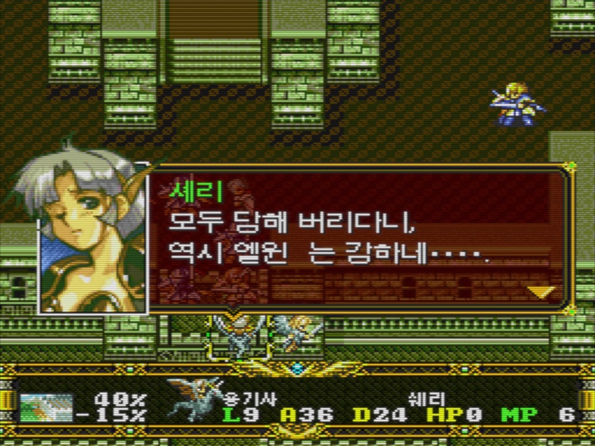 | 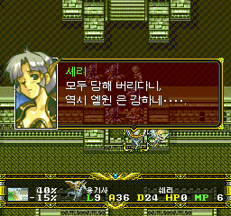 |

98개 리소스 12,591행을 구조 검사했습니다. 모든 문장이 이번에 새로 직접 검수되었다는
뜻은 아닙니다. 선택 범위 밖 내부 보조 대본 86~98은 전체 번역 범위로 주장하지 않습니다.

## 6. 로우가 습득 마법 `증` → `참`

일본판의 `チャーム`에 해당하는 마법이 오래된 글자 번호 때문에 `증`으로 표시됐습니다.
105개 공용 이름표와 3개 별도 사본을 정식 `참` 글자에 연결했습니다.
마법 ID·레벨업 습득 조건·효과·폰트의 원래 `증` 글자는 바꾸지 않았습니다.

| 수정 전 307 | 수정 후 308의 실제 습득 문구 |
| --- | --- |
| 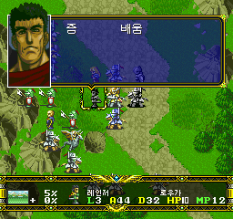 |  |

남아 있는 실제 캡처와 로그에서 `참 배움`을 확인했습니다. 이 사진이 마법 목록·사용
전 과정이나 모든 캐릭터의 레벨업을 검증했다는 뜻은 아닙니다.

## 7. 시나리오 셀렉트 50와 관련 존대·호칭

50번 152항목을 원문과 검수하고 46항목을 다듬었습니다. 동일 원문의 내부 복제 77에도
적용했습니다. 다른 시나리오의 관련 존대·호칭·줄바꿈까지 합쳐 110개 물리 항목을 수정했습니다.

| 수정 전 제보 | 수정 후 successor309 |
| --- | --- |
| 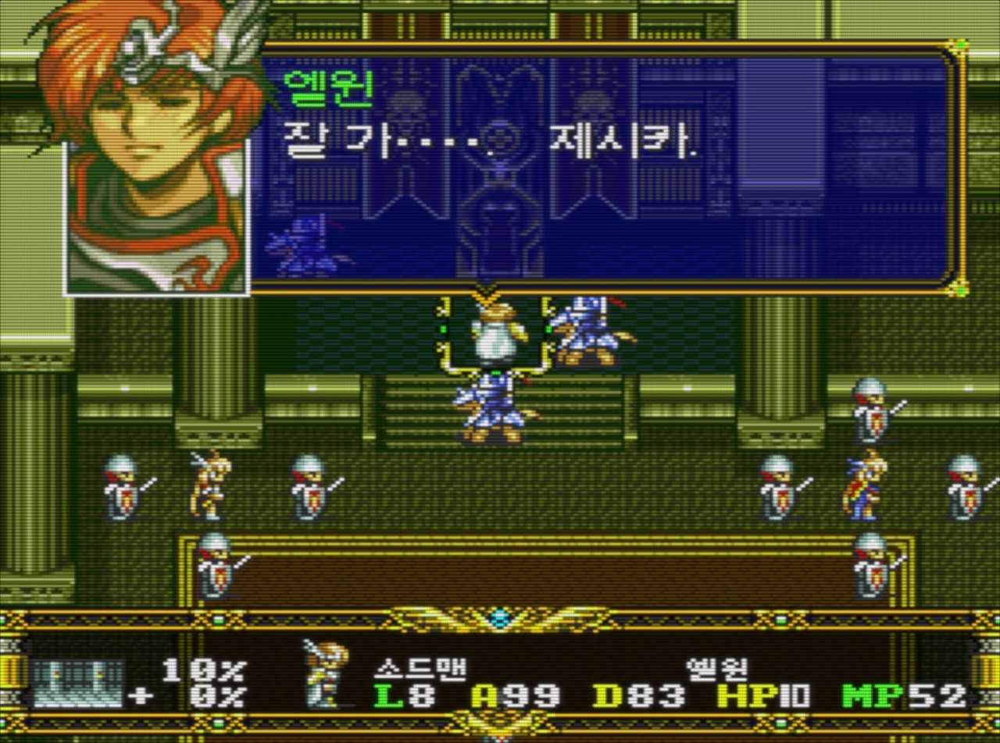 | 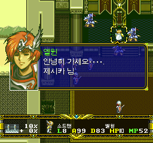 |
| 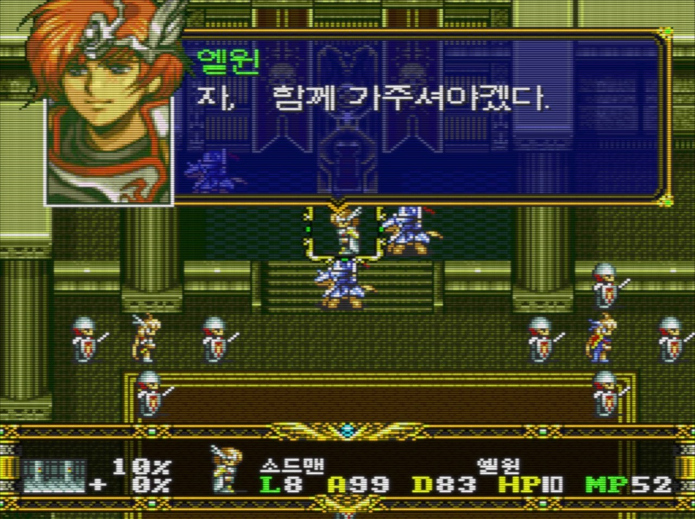 | 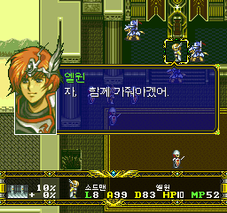 |

엘윈은 제시카에게 존대하도록 맞췄습니다. `하는 거예요!`는 `하는 겁니다!`로,
제시카가 리아나·라나에게 하는 `너희들만이라도 도망치거라.`는
`두 사람만이라도 도망치세요.`로 고쳤습니다. 아래 두 사진은 **수정 전 제보**이며,
이 문장들의 수정 후 확인은 데이터 검사입니다.

| 어투 제보 | 제시카의 반말 제보 |
| --- | --- |
| 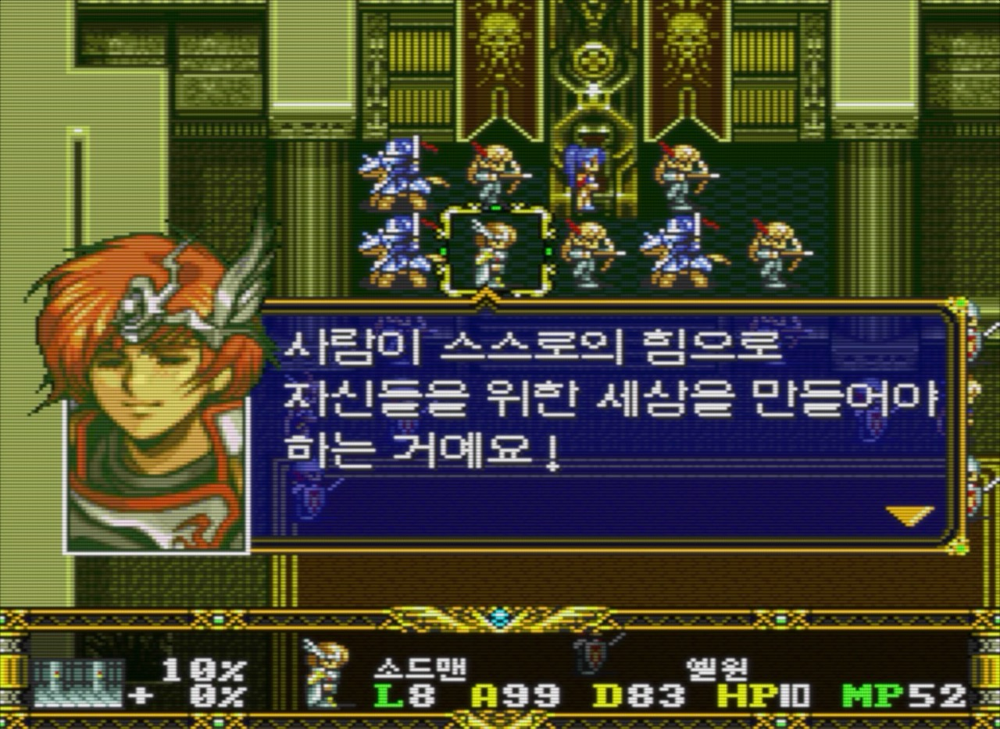 | 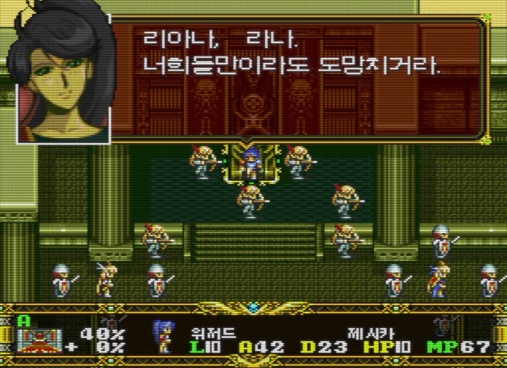 |

로우가의 문장은 `원망할 거라면,`까지 같은 줄에 두고 다음 내용을 이어가도록 했습니다.
음성 페이지를 추가하거나 게임 분기를 변경하지 않았습니다. 아래는 수정 전입니다.

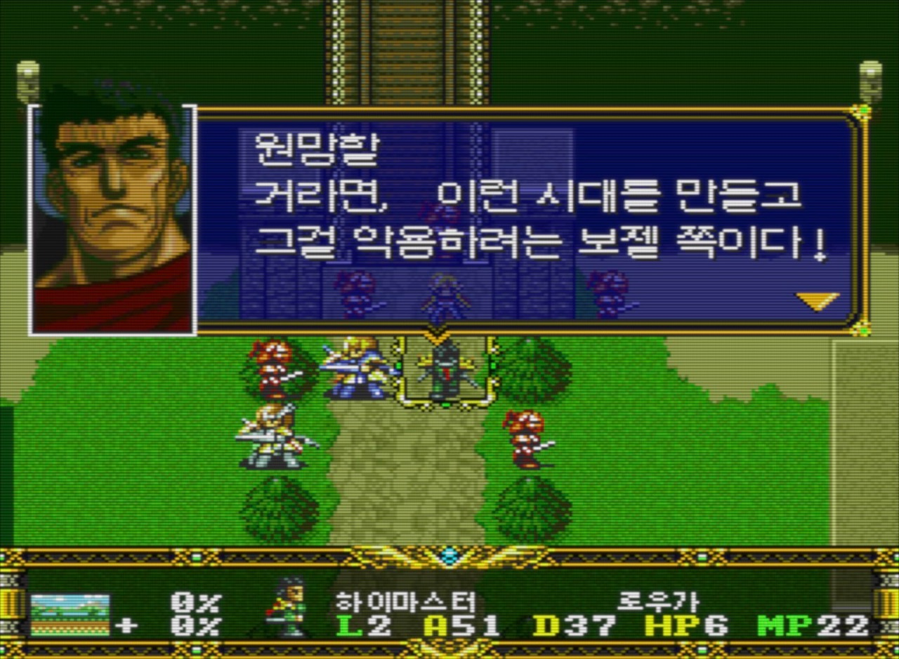

게임 대사의 `사부님` 호칭은 `스승님`으로 통일했습니다.

| 수정 전 제보 | 다른 장면의 스승님 표기 확인 309 — 동일 장면 비교 아님 |
| --- | --- |
| 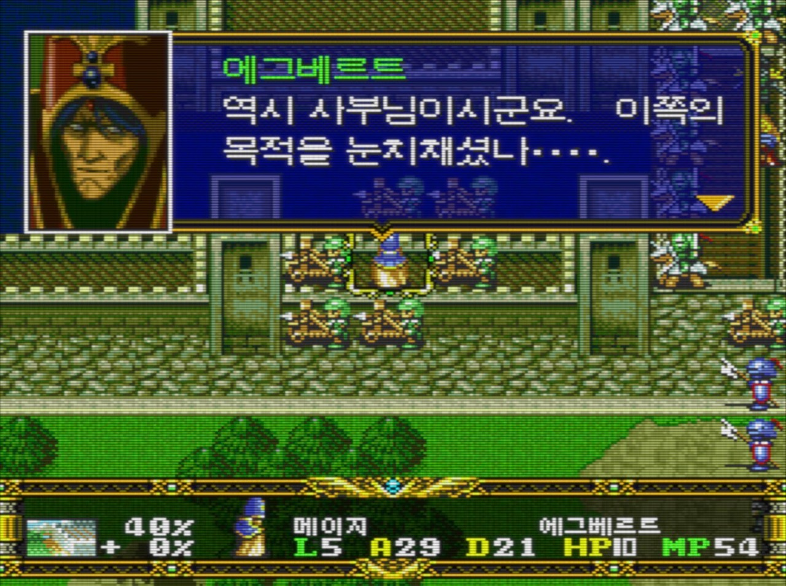 | 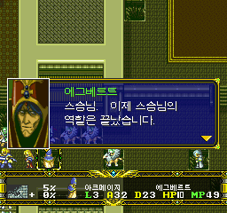 |

## 8. 누락된 별도 엔딩 대사 전체 번역

후일담과 별개인 **제국 엔딩 15개·어둠 엔딩 3개, 총 18개**를 번역했습니다.
개발용 번역 편집기의 `엔딩 대사` 분류에도 추가했습니다. 이 배포 ZIP은 게임 패처이며,
비공개 중간 자료가 필요한 전체 번역 편집기 실행 환경을 제공하는 것은 아닙니다.

최종 첨부 SRAM으로 엘윈이 제시카를 한 번에 처치한 뒤 제국 엔딩 대사, 후속 영상,
엘윈 후일담 진입까지 확인했습니다. 어둠 엔딩 3개는 데이터 검사 범위입니다.

| 제국 엔딩 첫 대사 | 알하자드·랑그릿사 |
| --- | --- |
| 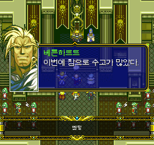 | 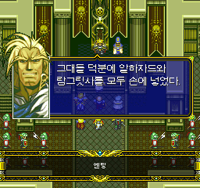 |

| 엘윈의 답변 | 헤인에게 병단 인계 |
| --- | --- |
| 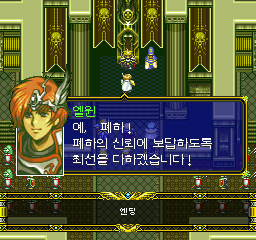 | 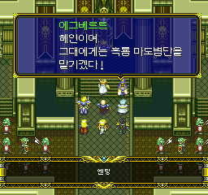 |

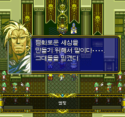

| 후속 영상 진행 | 기존 후일담 진입 |
| --- | --- |
| 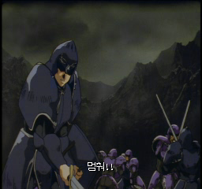 | 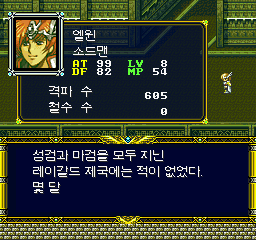 |

후일담 134개 × 5복제본 = 670항목의 표와 확장 문장은 기존 그대로 보존했습니다.
후속 영상·후일담 사진은 진행 확인용이며 그 내용을 이번에 새로 바꿨다는 뜻은 아닙니다.

## 9. 마법 사용 시 MP 부족 표시

`부족`만 보이던 안내에 게임이 읽을 수 있는 M/P 문자를 사용하도록 105개 사본을
수정했습니다. **MP 부족 실플레이 검증은 사용자 요청으로 생략했습니다.** 아래는
수정 전 사진이며, 수정 후 화면을 확인한 것처럼 제공하지 않습니다.

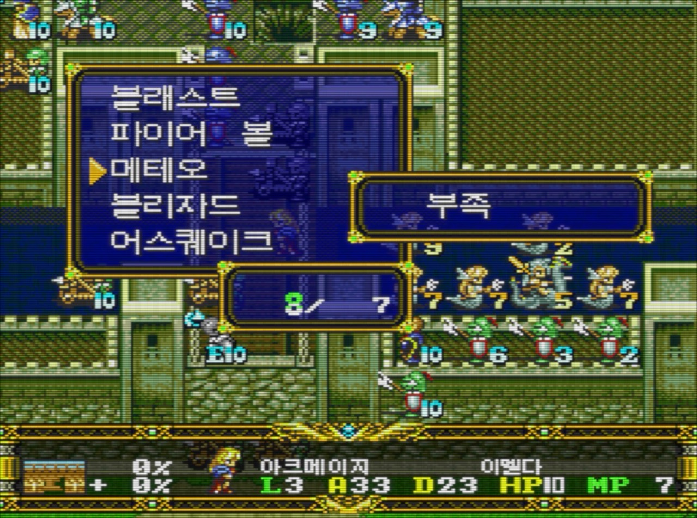

## 검증·유의 사항

- 승인된 successor309와 원본부터 새로 재구성한 결과, Python 패처·Windows EXE로
  만든 결과의 전체 트랙을 대조합니다. [배포 검증 기록](verification_V0.97.json).
- 35개 이미지는 보정·합성·재압축하지 않았습니다. 이전 빌드, 사용자 제보,
  테스트 상태의 구분과 파일 해시는 [사진 출처](../screenshots/V0.97/provenance.json)에 있습니다.
- 전 시나리오·전 분기·실기·iOS에서 무오류를 보장하는 릴리스가 아닙니다.
- **음악만 나오고 엔딩 화면이 검게 보이는 간헐적 문제는 미해결**입니다.
  이번 제국 엔딩이 정상 진행됐다는 사실을 그 문제의 해결로 확대하지 않습니다.
- 기존 V0.96 및 이전 릴리스·태그·파일은 보존합니다.

원작 게임과 사진 속 원작 자료는 프로젝트 MIT 라이선스 대상이 아닙니다.
[권리 안내](../LICENSE_SCOPE.md) · [오류 제보](https://github.com/OldManCraveGuitars-bit/langrisser-fx-korean-patch/issues).
