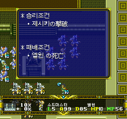
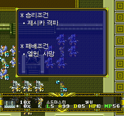
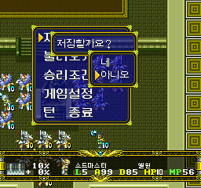
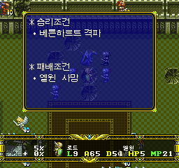

# V0.972 — 전체 승리·패배조건 검수 및 누락 수정

검증된 **successor310-review2**를 배포합니다. V0.97의 기존 수정은 모두 포함한
누적 패치이며, 이전 한글판이 아닌 **원본 일본판에 새로 적용**하세요.

## 수정 내용

- 시나리오 셀렉트 **77번**의 미번역 조건을 `제시카 격파 / 엘윈 사망`으로 수정.
  화면에 표시되는 `SCENARIO 21`은 해당 분기의 장 번호입니다.
- 전체 **98개 물리 필드 조건표**를 원문 대조했습니다. 메뉴799슬롯 중 문구472행과
  출격 전 조건 설명142개가 대상이며, 보조·복제 표도 포함합니다.
- 74~78, 86~98의 18개 표에 남아 있던 미번역46행을 수정했습니다.
- 주민 전멸, 도착/입수/탈출, 인접/설득의 의미와 뱀파이어 로드·랑그릿사 등
  대상명을 바로잡았습니다. 60번 추가 조건의 `혹은`은 `그리고`로 수정했습니다.
- 셰리 및 다크 로드 표기를 정리했습니다. 총49개 표의 **메뉴85행·안내11곳**이 바뀝니다.
- 승패 판정 로직을 변경하지 않았습니다. 대사·아이템·엔딩·음악 등 기존 수정은 보존합니다.

98개는 실제 플레이 가능한 시나리오 수가 아니라 데이터의 물리 조건표 수입니다.
보조88·90번에서 원문부터 다른 메뉴/출격 전 안내는 각각의 원래 의미를 유지했습니다.

## 실제 화면

아래5장은 합성·편집 없이 저장한 실제 에뮬레이터 화면입니다.

### 셀렉트77 수정 전후

|수정 전 — V0.97 / successor309|수정 후 — V0.972 / successor310-review2|
|---|---|
|||

### 설정 전환 후 재확인 및 기존 저장 질문

|조건창 재확인|저장 질문 회귀 확인|
|---|---|
|||

### 일반20화 조건 메뉴



[이미지 출처·해시](../screenshots/V0.972/README.md)

## 검증 범위와 남은 사항

- 전체 조건표 데이터 검사, 일본어 잔여·줄 폭 초과 검사 통과.
- 실제 실행은 제공 저장의77번과 일반20화에서 조건창·메뉴 전환·필드 복귀 확인.
- **전 시나리오·분기를 직접 플레이하거나 실기/iOS를 검증한 것은 아닙니다.**
- 기존의 음악만 나오고 엔딩이 검게 보이는 간헐적 문제는 미해결입니다.
- 사전 공개 버전이며, 앞선 버전의 알려진 한계도 유지됩니다.

[상세 검증](VERIFICATION_V0.972.md) · [V0.97 누적 수정 내역](https://github.com/OldManCraveGuitars-bit/langrisser-fx-korean-patch/releases/tag/V0.97)

## 설치

ZIP의 `Langrisser-FX-KR-Auto-Patcher-V0.972.exe`에 원본 일본판 CUE를 지정합니다.
원본3트랙은 그대로 보존하고 새 폴더에 결과를 만듭니다. SRAM을 먼저 백업하고
게임을 완전히 다시 실행한 뒤 게임 내부 저장을 불러오세요. 이전 빌드의 강제
세이브/상태 저장은 옛 코드·문구를 복원할 수 있으므로 사용하지 마세요.

결과 `Track-2.KR.bin`: **762,048,000 bytes**

```text
SHA-256: 397110E066F8CA2C13ABAF607D8AD85D82AAFBB0356FD36051389B1EF5FDD3CC
```

원본 게임·완성된 게임 이미지·BIOS·세이브는 배포하지 않습니다.
