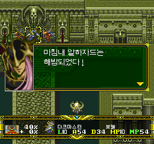
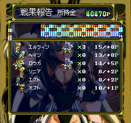
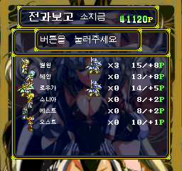
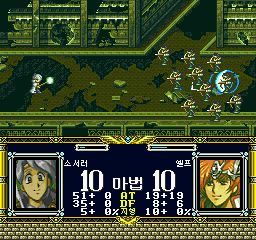
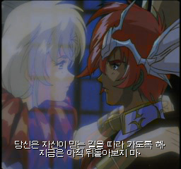
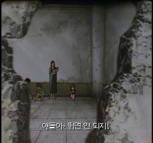
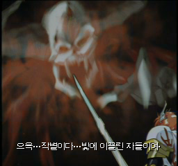
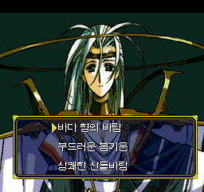
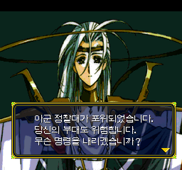
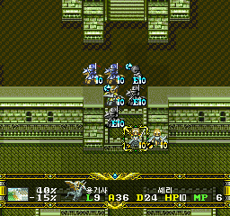

# V1.05 정식판 — 영상 자막 개선 + 일본판 원작 버그 3종 수정

데어 랑그릿사 FX 한국어 패치 **V1.05 정식판**입니다.
V0.972 이후의 대사·질문·후일담 교정과 최신 영상 자막을 모두 포함한 누적 패치입니다.
**한글화뿐 아니라, 일본판 원작에서도 발생하던 버그 3종을 함께 수정했습니다.**

## 일본판 원작 버그 3종 수정

### 1. 보젤 대사의 음성 잘못 연결·중복 재생

베른하르트 격파 뒤 보젤의 “마침내 알하자드는 해방되었다!” 대사에서
다음 다크 프린세스 음성이 먼저 나오고 다시 반복되던 문제를 수정했습니다.
실제로 존재하는 보젤의 원래 녹음을 다음 대사 화면에서도 이어 재생하도록
페이지 처리를 고쳤습니다. 다크 프린세스 음성은 본인 차례에만 나옵니다.
음성을 새로 만들거나 원본 녹음을 교체한 것이 아닙니다.



이 화면은315 검증 빌드의 무편집 캡처입니다. 음성 자체의 증거는 화면이 아니라
빠른/느린 페이지 넘김 양쪽의 음원 구간 추적과 녹음이며, 수정 바이트는 V1.05에 유지됩니다.

### 2. 전과보고 마지막 적군 그래픽·보상 데이터 손상

일본판도 적군 지휘관은 최대20명까지 모으면서 실제 목록 공간은12명분만
사용했습니다. 13번째 적군 정보가 애니메이션 상태와 겹쳐 마지막 처리에서
화면이 깨지고 잘못된 데이터를 읽던 문제를 **20명분의 독립 공간**으로 고쳤습니다.
원래 적군 목록·처리 순서·보상 계산식은 유지합니다. 잘못 읽던 마지막 적군 정보가
복구되므로 실제 정산 금액은 수정 전과 달라질 수 있습니다.

| 일본판 원작에서 재현한 깨짐 | 수정 후 전과보고 완료 |
| --- | --- |
|  |  |

같은 제공 세이브로 일본판과319에서 확인한 화면입니다. V1.05는 이 수정 코드를 그대로 포함합니다.

### 3. 텔레포트 대상 아군 원거리 병사의 시전자 공격 연출

엘프·바리스타 등에게 텔레포트를 쓰면 대상 병사들이 마법 시전자를 공격하던
원판의 전투 연출 오류를 수정했습니다. 대상 병사의 불필요한 물리 공격 참여만
막고, 병종 그림·능력치·텔레포트 이동 효과는 유지합니다.
원판에서 확인된 문제는 공격/HP 감소 **연출**이며, 실제 맵 HP 피해까지 발생했다고
확인한 것은 아닙니다.



320의 실제 실행 캡처입니다. 엘프·바리스타·하이엘프·위치·근접 병사 및 시전자HP1을
격리 시험했습니다. 병종/HP만 시험용으로 설정했으며 수정 코드는 최종 디스크에서 로드했습니다.

## 영상 자막 갱신

- 사용자 교정 문구, 표시 시작/끝 시간, 추가 및 삭제한 자막을 그대로 반영했습니다.
- 최종 **23개 영상에169개 자막**을 수록합니다. 모든 영상에 대사가 있는 것은 아닙니다.
- 카오스, 리아나의 약속, 고아원 장면을 포함합니다.
- 한국어 자막만 갱신하며 원본 음성·영상은 유지합니다. 별도 자막용 세이브 파일은 필요 없습니다.

| 리아나의 약속 — V1.05 | 고아원 — V1.05 |
| --- | --- |
|  |  |



위 자막 화면은 최종321을 새로 부팅한 영상 선택 메뉴에서 촬영했습니다.
영상006·015·016의 자막 로드·표시·재생 종료를 확인했으며, 모든 자연 엔딩 분기를 재생한 것은 아닙니다.

## 대사·질문·후일담 누적 수정

- 8×8 공통 이름 표시의 **‘쉐리’를 ‘셰리’로 통일**했습니다.
  하단 정보창·전투·병사배속·전과보고가 공유하는 글꼴 15개 사본을 모두 수정했습니다.
- 전체 시나리오1~85 대사 **11,474항목**의 줄바꿈을 검사하고930항목을 정리했습니다.
  “알고 있습니다.”, “왜 그래! 보젤 님은”처럼 의미가 이어지는 말이 어색하게 갈라지는 부분을 개선했습니다.
- 셀렉트45~77의33개 자료, **4,318항목**을 확인해137항목의 문구·말투·표기를 수정했습니다.
  복제 반영과 띄어쓰기도 포함한 수치이며137개 모두 오역이라는 뜻은 아닙니다.
  리아나·라나의 말투는 관계만 보고 바꾸지 않고 일본판 원문의 정중체/보통체를 존중했습니다.
- 카오스 대사를 “하지만 나는 혼돈의 신. / 이대로 끝나지는 않는다.”로 교정했습니다.
- 루시리스 질문20개·선택지60개를 교정하고, 잘못된 공백이 한자로 보이던19곳을 수정했습니다.
  단어 사이104개 공백은 **반각**으로 통일했습니다.
- “아군 정찰대가 포위되었습니다.” 질문의 첫 줄이 페이지 전환으로 누락되던 문제를 고쳤습니다.
- 후일담134항목 중19항목에 있는 엘윈 뒤 조사23곳을5개 복제에 동일하게 반영했습니다.
- 임시 메모리의 한글 글꼴 처리 코드를 참조해 전투 메뉴가 멈추던 한글판 회귀를 수정했습니다.
- V0.972의 전체 승패조건, 앞선 시나리오·아이템 폐기 UI·참 마법명·엔딩 번역·스승님 호칭·MP 표시 수정도 포함합니다.

| 반각 공백 선택지 —318 | 정찰대 질문 전체 표시 —318 |
| --- | --- |
|  |  |



최종 배포판은322입니다.321에서 8×8 셰리 글자만 수정했으며, 영상 자막과 다른 수정은 동일합니다.

## 설치와 주의 사항

1. `Langrisser_FX_Korean_Patch_V1.05.zip`을 풀고 `Langrisser-FX-KR-Auto-Patcher-V1.05.exe`를 실행합니다.
2. 지원되는 **원본 일본판 CUE**를 지정합니다. 원본BIN3개를 CUE와 함께 두세요.
3. 새로 생성된 폴더의 `Langrisser-FX-KR.cue`를 실행합니다.

**이전 한글판에 덧씌우지 마세요.** SRAM을 백업하고 게임을 완전히 다시 실행한 뒤
게임 내 저장을 불러오세요. 구버전의 강제 세이브/상태 저장은 이전 코드를 복원할 수 있습니다.

결과 `Track-2.KR.bin`: **762,048,000 bytes**

```text
SHA-256: E5D8E1B42F3309BD3EA16B82863E6F27F85DC2C993202E5A0295BDDD4979B32F
```

정식판 표기는 모든 분기·실기·에뮬레이터의 무오류 보증이 아닙니다.
**간헐적 엔딩 검은 화면은 별도 미해결 사항**이며 이번 수정으로 해결됐다고 주장하지 않습니다.
MP 부족의 실플레이 확인은 사용자 요청대로 생략했습니다.
이전 누적 개발 도구의 실패8건·오류1건을 모두 해결했다는 주장도 하지 않습니다.

[검증 상세](VERIFICATION_V1.05.md) · [이미지 출처](../screenshots/V1.05/README.md)
· [설치 안내](../patch/INSTALL.txt)

원본 게임·완성된 디스크 이미지·BIOS·음원·세이브는 배포하지 않습니다.
스크린샷은 실제 캡처를 편집·합성하지 않고 포함했으며 원작 자료의 권리는 권리자에게 있습니다.
