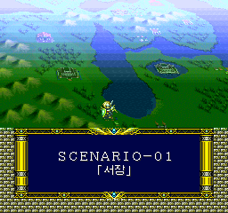
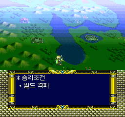
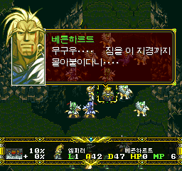
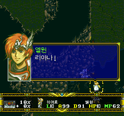
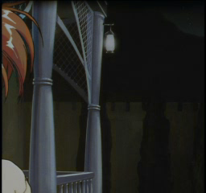
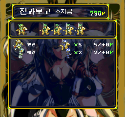

# V1.1 정식판 — RUN 1.2초 대사·나레이션·영상 스킵

대사와 영상을 빠르게 넘기는 편의 기능을 추가했습니다.
**V1.05의 번역·자막 및 일본판 원작 버그 3종 수정이 모두 포함된 누적 패치**입니다.

## 사용 방법

1. 입력 가능한 대사·나레이션 또는 게임 진행 중 영상에서 **RUN을 약 1.2초** 누릅니다.
2. 대사는 화자나 아군·적군이 바뀌어도 연결된 구간 전체를 계속 넘깁니다.
   활성화 후에는 버튼을 놓아도 그 구간의 스킵이 유지됩니다.
3. **선택지, 유닛 배치·퇴장·행동, 지도 변경, 영상 등 실제 진행 전환**에서는 멈춥니다.
   선택지를 자동으로 고르거나 배치·보상 이벤트를 없애는 기능이 아닙니다.
4. 다음 구간도 넘기려면 **RUN을 놓았다가 다시 1.2초** 누르세요.

연속 스킵 중 대사 음성 대기도 기존 취소 처리로 단축됩니다.
게임 중 영상은 원래 종료 처리로 빠져나오며, 오마케의 기존 스킵 조작은 바꾸지 않았습니다.
디스크 읽기·화면 이동·이벤트 연출까지 즉시 없애는 것은 아닙니다.

## 실제 실행 화면

아래는 최종 successor324를 새로 부팅해 기록한 무편집 화면입니다.
정지 화면 자체가 1.2초 타이밍이나 모든 분기의 정상 동작을 증명하는 것은 아닙니다.
타이밍과 정지 경계는 별도의 입력·상태 기록으로 확인했습니다.

| 나레이션 스킵 전 | 승리조건 안내에서 정지 |
| --- | --- |
|  |  |

| 전투 후 대사 시작 | 유닛 퇴장·배치 뒤 다음 대사에서 정지 |
| --- | --- |
|  |  |

| 게임 진행 중 영상 | 영상 스킵 후 전과보고 |
| --- | --- |
|  |  |

영상 검수는 격리 실행에서 발드의 HP만 0으로 설정하고, 원래 턴 종료·승리 이벤트를 거쳐
진입했습니다. 배포 게임이나 사용자 세이브에 HP 변경을 넣은 것이 아닙니다.
[이미지 출처와 검수 조건](../screenshots/V1.1/README.md)을 함께 확인해 주세요.

## 기존 수정 유지

**한글화뿐 아니라 일본판 원작의 버그 3종도 수정된 상태로 유지됩니다.**

- 보젤 대사에서 다크 프린세스 음성이 먼저 나오고 반복되던 문제.
- 전과보고의 마지막 적군 처리에서 그래픽·보상 데이터가 손상되던 문제.
- 아군 원거리 병사에게 텔레포트를 쓰면 시전자를 공격하던 연출 문제.

V1.05의 23개 영상 169개 자막, ‘셰리’ 이름 통일, 누적 대사·질문·후일담·승패조건
교정도 그대로 포함합니다. 텔레포트 문제는 공격 연출 오류이며 실제 맵 HP 피해까지
입증되었다는 뜻은 아닙니다.
[V1.05의 상세 수정 및 당시 화면](https://github.com/OldManCraveGuitars-bit/langrisser-fx-korean-patch/blob/V1.05/docs/RELEASE_V1.05.md)

## 설치

1. `Langrisser_FX_Korean_Patch_V1.1.zip`을 풀고 `Langrisser-FX-KR-Auto-Patcher-V1.1.exe`를 실행합니다.
2. 지원되는 **원본 일본판 CUE**를 선택합니다. 원본 BIN 3개도 함께 있어야 합니다.
3. 생성된 폴더의 `Langrisser-FX-KR.cue`로 실행합니다.

**이전 한글판 BIN에 덧씌우지 마세요.** SRAM을 백업하고 게임을 완전히 재실행한 후
게임 내 저장을 불러오세요. 구버전 상태 저장은 옛 코드를 복원할 수 있습니다.

결과 `Track-2.KR.bin`: **762,048,000 bytes**

```text
SHA-256: 198965A8481A97A1E0535FDC80918A0982EE643C4FFD0039F20D2C9697273580
```

## 검증과 제한

승인된 1.5초 테스트판과 기능은 같고, 타이머 2바이트만 90→72프레임으로 변경했습니다.
1,537개 명령 검사, 지정 대사·나레이션·영상의 실제 실행, 원판에서 두 설치 방식의
전체 결과 비교 및 배포 ZIP 검사를 진행했습니다.

- 전 시나리오·선택지·영상·실기 전수 플레이 검증은 아닙니다.
- 최초 길게 누르기는 입력 대기부터 계산합니다. 짧은 자동 진행 페이지는 시작 전에 끝날 수 있습니다.
- 전과보고·통계·캐릭터 후일담은 이번 스킵 기능의 대상이 아닙니다.
- **간헐적 엔딩 검은 화면은 여전히 미해결**이며, 기존 누적 도구의 실패 8건·오류 1건 해결도 주장하지 않습니다.

[검증 상세](VERIFICATION_V1.1.md) · [설치 안내](../patch/INSTALL.txt)

원본 게임·완성된 디스크 이미지·BIOS·음원·세이브는 배포하지 않습니다.
이전 릴리스와 첨부 파일은 보존합니다.
