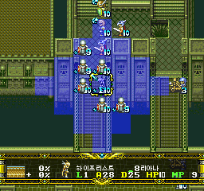
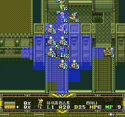

# v0.851 — HUD commander-name cleanup

Development/pre-release, cumulative from the original Japanese game.
Internal target: successor289. Previous v0.85 fixes remain included.

## 수정 내용

- 시나리오 12에서 리아나의 하단 8×8 이름 앞에 남던 글자를 제거했습니다.
- 잔여 타일을 SCENARIO 숫자로 잘못 판정하던 공통 처리를 수정했습니다.
  리아나만 예외 처리한 것이 아니라 15개 필드 복사본의 이름 표시 경로에 적용했습니다.
- 이름 외 화면에서는 기존 숫자 표시 규칙을 유지했습니다.
- 글꼴 픽셀·이름/직업 표·문자 간격·대사·전투 수치·영상 자막은 변경하지 않았습니다.
  v0.85 대비 실제 변경은 공통 보조 코드 안의 735바이트뿐입니다.
- 이전 엔젤→피닉스 전투 프리징, 로열랜서 하단 ‘로’ 글꼴 및 결과창 그래픽 수정은
  이번 누적 패치에도 포함됩니다. 이번에 그 항목들을 다시 수정했다는 뜻은 아닙니다.

## 실제 수정 전후 / Actual before and after

같은 시나리오 12 세이브와 같은 입력 기록으로 전원을 켠 뒤 촬영한
256×240 원본 캡처입니다. 이름 앞 잔상 38픽셀만 다르고 나머지 화면은 동일합니다.
보정·합성·확대·재그리기를 하지 않았습니다. 이미지를 누르면 원본을 볼 수 있습니다.

| Before — v0.85 / successor288 | After — v0.851 / successor289 |
| --- | --- |
|  |  |

The screenshots are unedited game captures, not separately drawn previews.
Original game artwork remains the property of its rights holders and is not
relicensed under MIT. See [license scope](../LICENSE_SCOPE.md).

## 검증 범위

- 이름 번호 167개, 기본/별칭 출력 경로 333개를 데이터와 실제 생성 명령어로 검사했습니다.
- 접두 타일 값 65,536개를 이름/비이름 두 문맥에서 각각 검사했습니다.
- 15개 뱅크의 201개 글리프와 이름 표가 기존 값 그대로임을 확인했습니다.
- 시나리오 12의 이름·상세창 열기/닫기·병사·빈 땅·이름 복귀를 실제 구동했습니다.
- 시나리오 10에서도 이름↔SCENARIO 10 전환을 확인했습니다.
- 다른 모든 시나리오를 직접 플레이한 것은 아닙니다. 공통 데이터/코드 검증과
  대표 시나리오 실동작 검증을 구분합니다.

## Installation / 적용 방법

Download `Langrisser_FX_Korean_Patch_v0.851.zip` from this release.
Run `Langrisser-FX-KR-Auto-Patcher-v0.851.exe` and select the supported
**original Japanese CUE**. It checks all three source tracks and creates a new
output folder. Do not apply it over an older Korean BIN.

원본 일본판에 새로 적용하는 누적 패치입니다. SRAM을 먼저 백업하고,
새 버전에서는 게임 내 저장을 불러오세요. 이전 버전의 강제 세이브/상태 저장은
이전 코드를 복원할 수 있으므로 사용하지 마세요. 원본과 기존 출력은 덮어쓰지 않습니다.

See `INSTALL.txt` in the ZIP or [repository instructions](../patch/INSTALL.txt).
The ZIP includes the automatic patcher, Python fallback, patch, notices,
correction/verification reports and these two screenshots; no game image or save.

## English summary

The prefix cleanup previously mistook a stale native name tile for a scenario
digit. The helper now recognizes the rendered private Korean name first and
clears the two preceding cells in that context, while retaining the old numeric
guard elsewhere. This is a shared-context fix, not a Liana-only glyph change.

Only 735 cooked bytes differ from v0.85, within the existing helper reservations.
Fonts, mappings, fixed positions and all other cooked bytes are identical.
Full details: [implementation](IMPLEMENTATION_v0.851.md),
[verification](VERIFICATION_v0.851.md), [publication scope](PUBLICATION_v0.851.md).

## Known limitations

Full hidden-dialogue wording review and all hidden/battle/ending branches are
not complete. Physical-console/iPhone QA and a complete campaign playthrough
are not recorded. The earlier tooling baseline had 8 failures and 1 error;
this update does not claim to repair them. Other historical condition-text
fields 74–98 remain outside this correction; these are internal field numbers,
not a count of additional playable scenarios. The public source is a curated
snapshot with some private authoring dependencies, not a standalone full build.
