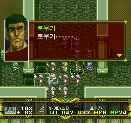
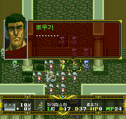
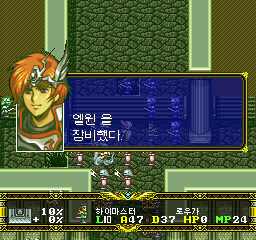
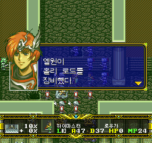
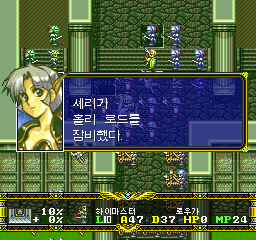

# v0.86 — 17화 대사와 홀리 로드 장비 안내 수정

## 한국어 수정 내역

**원본 일본판에 적용하는 누적 패치**입니다. 내부 빌드는 **296**이며,
앞선 v0.855의 수정과 그 이후 저장한 15화 추가 수정도 포함합니다.
기존 한글판 BIN에 덧씌우지 말고 원본 일본판 CUE에 새로 적용하세요.

### 1. 시나리오 17 전체 대사 검수

- 129개 레코드를 일본판 원문과 대조하고, 의미·말투·어절 끊김 28곳을 수정했습니다.
- 엘윈이 “로우가…”라고 부르는 대사는 유지했습니다. 바로 다음에 로우가가
  자기 이름을 말하던 오류는 **일본판처럼 말줄임표만 표시**하도록 고쳤습니다.
- 역할 분담, 레온의 응답, 로우가의 도전, 수색 결과와 엄호 명령 등의 표현을 다듬었습니다.
- **일본판의 페이지 수·넘김·대기·이름 제어 순서는 변경하지 않았습니다.**
  줄바꿈은 해당 일본판 페이지 안에서 한국어 구절에 맞춰 정리했습니다.
- 화자 확인이 더 필요한 112번과 일본판이 비어 있는 126–128번은 추측으로 바꾸지 않았습니다.

| 수정 전: 로우가가 자기 이름을 말함 | 수정 후: 일본판과 같은 말줄임표 |
| --- | --- |
|  |  |

### 2. 처치 후 홀리 로드 장비 안내

로우가 처치 후 실제로 홀리 로드가 이전되어도 “엘윈을 장비했다.”라고 나오던
안내를 고쳤습니다. 실제 수령자와 장비를 읽고, 이름의 받침에 따라 **이/가**를
선택합니다. 이름·장비명의 불필요한 끝 여백은 **이 안내문에서만** 제거합니다.
다른 메뉴에서 쓰는 공용 이름표와 글꼴은 바꾸지 않았습니다.

기본 이름에서는 다음처럼 표시됩니다.

    엘윈이                 셰리가
    홀리 로드를            홀리 로드를
    장비했다.              장비했다.

“목걸이 입수”는 처치 직후의 별도 정상 이벤트이며 유지했습니다.
그 뒤의 대화와 **홀리 로드 장비 이전 안내**를 혼동하지 않도록 수정했습니다.
아이템 지급·이전 규칙이나 전투 계산을 바꾼 패치는 아닙니다.

| 수정 전 | 수정 후: 엘윈 |
| --- | --- |
|  |  |

**엘윈·셰리 각각의 처치 경로에서 실제 장비 안내와 지도 복귀까지 확인했습니다.**

### 3. 저장한 15화 추가 수정 적용

사용자가 편집기에 저장한 **116번·131번**을 그대로 반영했습니다.
이전 22번 수정도 유지합니다. 두 항목의 일본판 4페이지·2페이지 및 이름 제어를
보존했고, 나머지 142개 레코드는 v0.855와 동일하게 유지했습니다.

## 검증과 남은 사항

17화 전체 대사에 인코딩·누락 글자·줄 배치·페이지/제어 순서·압축 왕복 검사를
수행했습니다. 기본 이름표 78개와 105개 복제본의 조사 선택을 점검하고,
장비 안내 2,765가지 합성 입력 및 이전 처리 3,360가지 데이터 조합을 검사했습니다.
이는 모든 캐릭터로 실제 플레이했다는 뜻이 아닙니다.

임의로 변경한 주인공 이름의 조사, 모든 스토리 분기, 숨은 던전의 전체 문장 검수,
실기/iPhone 검증은 완료를 주장하지 않습니다. 기존 누적 도구 검사의 실패 8개·
오류 1개도 이번에 모두 해결했다는 뜻이 아닙니다.

**버그·번역 누락·어색한 문장이 보이면
[GitHub Issues에 등록해 주세요.](https://github.com/OldManCraveGuitars-bit/langrisser-fx-korean-patch/issues)**
버전·시나리오·재현 순서·스크린샷을 함께 적어 주세요. 원본 게임·BIOS·개인정보는
첨부하지 마세요. 이번 버전도 커뮤니티 검수를 위한 사전 공개 버전입니다.

## English summary

- Reviews all 129 S17 records and applies 28 individually reviewed wording/layout
  corrections, preserving Japanese page/wait/name control topology.
- Removes Rouga's erroneous self-name; Elwin's preceding “Rouga…” remains intact.
- Fixes the native Holy Rod transfer notice to show the actual recipient,
  the appropriate Korean subject particle, and the actual equipment name.
  Only transient trailing name/item padding is trimmed; shared name pools stay unchanged.
- Includes the maintainer's additional S15/116 and S15/131 edits.
- Retains previous cumulative fixes. This is a development prerelease, not an
  all-branch, arbitrary-custom-name or all-platform completion claim.

Use **Langrisser-FX-KR-Auto-Patcher-v0.86.exe** with the supported original Japanese
CUE. Back up SRAM and load an in-game save; old emulator states can restore old
patched code. No original or fully patched game images, BIOS or saves are included.

[검증 / Verification](VERIFICATION_v0.86.md) ·
[구현 / Implementation](IMPLEMENTATION_v0.86.md) ·
[공개 범위 / Publication](PUBLICATION_v0.86.md) ·
[스크린샷 출처](../screenshots/v0.86/README.md)
