# v0.865 — 시나리오 18 대사 누락 수정

## 한국어 수정 내역

**원본 일본판에 적용하는 누적 패치**입니다. 내부 빌드는 **297**입니다.
v0.86의 17화 대사·장비 안내와 앞선 수정도 모두 포함합니다.

### 1. 적 사망·턴 이벤트의 빈 대사 복구

18화에서 일부 적이 죽을 때, 그리고 턴 종료 뒤 소니아와 뱀파이어 로드 등이
말할 때 이름만 나오고 본문이 비던 문제를 수정했습니다.

번역문 일부는 디스크에 있었지만, 중간에 들어간 빈 데이터 때문에 게임이
잘못된 빈 문자열을 읽고 있었습니다. **뒤쪽 24개 내용 항목이 영향받았습니다.**
원본의 대사 순서를 통째로 복구하여 해당 항목들을 올바르게 연결했습니다.

| 수정 전: 리빙 아머 사망 대사 누락 | 수정 후: 일본판과 같은 괴성 |
| --- | --- |
| 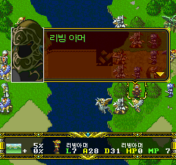 | 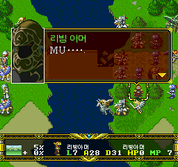 |

이 영문 괴성은 일본판에도 그대로 나옵니다.
[같은 장면의 일본판 화면](../screenshots/v0.865/japanese-death.png)

| 수정 전: 소니아 본문 누락 | 수정 후 |
| --- | --- |
| 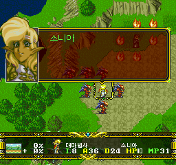 | 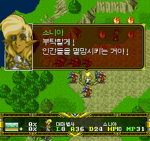 |

| 수정 전: 뱀파이어 로드 본문 누락 | 수정 후: 첫 페이지 |
| --- | --- |
| 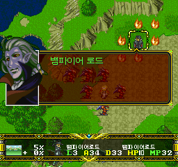 | 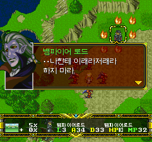 |

### 2. 시나리오 18 전체 누락 검사

- **내용 항목 96개 + 원본의 빈 끝 항목 2개**를 전부 대조했습니다.
- 영문 괴성 8개, 이름만 부르는 항목, 말줄임표만 있는 항목도 빠짐없이 유지합니다.
  영문 괴성은 일본판 원래 표현이므로 번역 누락이 아닙니다.
- “고 말。”처럼 오염된 말줄임표와 빠진 말줄임표를 바로잡았습니다.
- 감탄사 “홍!”을 “흥!”으로 고치고, 기존 글자를 덮어쓰지 않는 별도 12×12
  글자 한 칸을 추가했습니다.
- 두 항목의 의미상 페이지 끊음을 일본판에 맞췄습니다. **일본판의 페이지 수,
  넘김·대기·이름 제어 순서는 바꾸지 않았습니다.**
- 제목·나레이션·승리/패배 조건도 대조했습니다. 조건은 **소니아 격파 / 엘윈 사망**입니다.

| 새 글자 “흥”이 포함된 4번째 페이지 | 이어지는 5번째 페이지 |
| --- | --- |
| 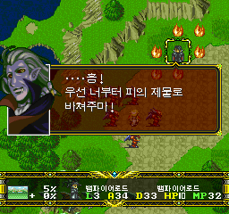 | 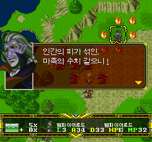 |

턴 종료 후에는 소니아·뱀파이어 로드·서큐버스·에스트·오스트의 이어지는
대사를 확인했습니다. 적 사망과 지도 복귀, 승리조건의 실제 확인 범위는
[검증 보고서](VERIFICATION_v0.865.md)에 구분해 기록했습니다.

후속 이벤트와 승리조건 화면

| 서큐버스 | 에스트 | 오스트 |
| --- | --- | --- |
| 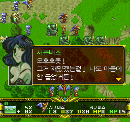 | 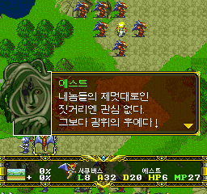 | 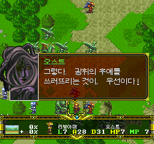 |

| 승리·패배 조건 | 메뉴를 닫은 뒤 지도 |
| --- | --- |
| 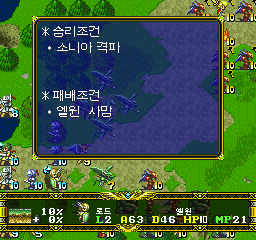 | 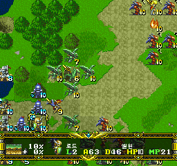 |

## 설치와 주의사항

**Langrisser-FX-KR-Auto-Patcher-v0.865.exe**를 원본 일본판 CUE에 적용하세요.
이전 한글판 BIN에 덧씌우지 마세요. SRAM은 백업하고 게임 내 저장을 불러오세요.
이전 빌드의 강제 상태 저장은 옛 코드를 복원할 수 있으므로 권장하지 않습니다.

이 버전도 **사전 공개 버전**입니다. 이번의 전 항목 데이터 검사와 지정 경로
플레이 확인은 모든 분기·스테이지·기기의 무오류를 보장하지 않습니다.
숨은 던전의 전체 문장 검수와 전 분기 플레이는 아직 남아 있으며, 기존 누적
도구 검사의 실패 8개·오류 1개를 모두 해결했다는 뜻도 아닙니다.

**버그·번역 누락·어색한 문장이 보이면
[GitHub Issues에 등록해 주세요.](https://github.com/OldManCraveGuitars-bit/langrisser-fx-korean-patch/issues)**
버전·시나리오·조작 순서·스크린샷을 함께 적어 주세요. 원본 게임·BIOS·개인정보는
첨부하지 마세요.

## English summary

Repairs Scenario 18's blank enemy-death and turn-event dialogue. Twenty-four
content entries were resolving into padding instead of their existing bodies.
The entire native stream now retains all 96 content entries and two original
empty tail entries, including Latin cries, a name-only call and punctuation.
Japanese page/wait/name controls are preserved. Punctuation corruption and two
semantic page splits are corrected; one 12×12 Hangul glyph is appended without
overwriting prior glyphs. All unrelated bytes remain identical to v0.86.

This cumulative development prerelease requires the supported original Japanese
disc. It contains no original/fully patched game image, BIOS or save.

[검증 / Verification](VERIFICATION_v0.865.md) ·
[구현 / Implementation](IMPLEMENTATION_v0.865.md) ·
[공개 범위 / Publication](PUBLICATION_v0.865.md) ·
[스크린샷 출처](../screenshots/v0.865/README.md)
